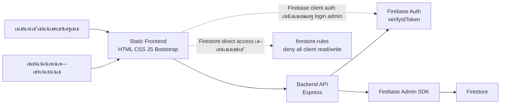

# เธฃเธฒเธขเธ‡เธฒเธ™เธงเธดเน€เธ„เธฃเธฒเธฐเธซเนŒเน‚เธ›เธฃเน€เธˆเธ„ WEB-LAW เนเธšเธšเธฅเธฐเน€เธญเธตเธขเธ”

เธงเธฑเธ™เธ—เธตเนˆเธงเธดเน€เธ„เธฃเธฒเธฐเธซเนŒ: 2026-06-06
เธžเธทเน‰เธ™เธ—เธตเนˆเธ‡เธฒเธ™: `D:\web test`
เธชเธ–เธฒเธ™เธฐเน€เธญเธเธชเธฒเธฃ: เธชเธณเธซเธฃเธฑเธšเนƒเธŠเน‰เธ•เธฃเธงเธˆ readiness, เธชเนˆเธ‡เธ•เนˆเธญเธ—เธตเธกเธ—เธ”เธชเธญเธš, เนเธฅเธฐเธงเธฒเธ‡เนเธœเธ™เธžเธฑเธ’เธ™เธฒเธ•เนˆเธญ

## 1. เธชเธฃเธธเธ›เธœเธนเน‰เธšเธฃเธดเธซเธฒเธฃ

เน‚เธ›เธฃเน€เธˆเธ„เธ™เธตเน‰เน€เธ›เน‡เธ™เน€เธงเน‡เธšเธžเธญเธฃเนŒเธ—เธฑเธฅเธเธŽเธซเธกเธฒเธข IT เธ เธฒเธฉเธฒเน„เธ—เธข เธกเธต frontend เนเธšเธš static HTML/CSS/JavaScript เนเธฅเธฐ backend เนเธšเธš Node.js/Express เธ—เธณเธซเธ™เน‰เธฒเธ—เธตเนˆเน€เธ›เน‡เธ™ API gateway เน„เธ›เธขเธฑเธ‡ Firebase Admin SDK เนเธฅเธฐ Firestore

เธ เธฒเธžเธฃเธงเธกเธ›เธฑเธˆเธˆเธธเธšเธฑเธ™เธ–เธทเธญเธงเนˆเธฒเน‚เธ„เธฃเธ‡เธชเธฃเน‰เธฒเธ‡เธซเธฅเธฑเธเธ–เธนเธเธขเธเธฃเธฐเธ”เธฑเธšเธ‚เธถเน‰เธ™เธกเธฒเธเนเธฅเน‰เธง:

- Frontend เน„เธกเนˆเธ„เธงเธฃเธญเนˆเธฒเธ™เธซเธฃเธทเธญเน€เธ‚เธตเธขเธ™ Firestore เน‚เธ”เธขเธ•เธฃเธ‡เธชเธณเธซเธฃเธฑเธšเธ‚เน‰เธญเธกเธนเธฅเธซเธฅเธฑเธ `laws` เนเธฅเธฐ `cards`
- Firestore rules เธ›เธดเธ” client read/write เธ—เธฑเน‰เธ‡เธซเธกเธ” เธ—เธณเนƒเธซเน‰เธ•เน‰เธญเธ‡เธœเนˆเธฒเธ™ backend เธเนˆเธญเธ™
- Backend เธกเธต input validation, sanitizer, admin authentication, CORS, Helmet เนเธฅเธฐ rate limiting
- เธซเธ™เน‰เธฒ frontend เธ–เธนเธเธ›เธฃเธฑเธšเนƒเธซเน‰เนƒเธŠเน‰ Bootstrap เธŠเนˆเธงเธขเน€เธฃเธทเนˆเธญเธ‡เธซเธ™เน‰เธฒเธ•เธฒเนเธฅเธฐ responsive layout
- เธเธฒเธฃ render เธ‚เน‰เธญเธกเธนเธฅ dynamic เธชเนˆเธงเธ™เนƒเธซเธเนˆเน€เธฅเธดเธเนƒเธŠเน‰ `innerHTML` เนเธฅเธฐเน€เธ›เธฅเธตเนˆเธขเธ™เน€เธ›เน‡เธ™ DOM API / `textContent`
- เธซเธ™เน‰เธฒ `home.html` เน€เธ›เน‡เธ™เธซเธ™เน‰เธฒเนเธฃเธเธ‚เธญเธ‡เน€เธงเน‡เธšเนเธฅเน‰เธง
- เธกเธต PRD เธชเธณเธซเธฃเธฑเธš TestSprite เนเธฅเน‰เธงเธ—เธตเนˆ `TESTSPRITE_PRD.md`

เธญเธขเนˆเธฒเธ‡เน„เธฃเธเน‡เธ•เธฒเธกเธขเธฑเธ‡เน„เธกเนˆเธ„เธงเธฃเธกเธญเธ‡เธงเนˆเธฒ production-ready เนเธšเธšเน€เธ•เน‡เธก 100% เธˆเธ™เธเธงเนˆเธฒเธˆเธฐเธ›เธดเธ”เธ›เธฃเธฐเน€เธ”เน‡เธ™เน€เธซเธฅเนˆเธฒเธ™เธตเน‰:

- เธ•เน‰เธญเธ‡เธขเธทเธ™เธขเธฑเธ™เธงเนˆเธฒ service account key เธ—เธตเนˆเน€เธ„เธขเธ–เธนเธเนƒเธŠเน‰เธซเธฃเธทเธญเน€เธ„เธขเธซเธฅเธธเธ”เนƒเธ™ repo เธ–เธนเธ revoke/rotate เนเธฅเน‰เธง
- เธขเธฑเธ‡เธกเธต `script-src 'unsafe-inline'` เนƒเธ™ CSP เน€เธžเธฃเธฒเธฐเธขเธฑเธ‡เธกเธต inline script เนเธฅเธฐ inline event handlers เธšเธฒเธ‡เธˆเธธเธ”
- เธเธฒเธฃเน‚เธซเธฅเธ” navbar เธขเธฑเธ‡เนƒเธŠเน‰ `innerHTML` เธเธฑเธšเน„เธŸเธฅเนŒ local static เธ‹เธถเนˆเธ‡เธ„เธงเธฒเธกเน€เธชเธตเนˆเธขเธ‡เธ•เนˆเธณ เนเธ•เนˆเธ„เธงเธฃเธ›เธฃเธฑเธšเธ–เน‰เธฒเธ•เน‰เธญเธ‡เธเธฒเธฃ harden CSP เธˆเธฃเธดเธ‡
- เธขเธฑเธ‡เน„เธกเนˆเธกเธต automated E2E test, route integration test, CI/CD เนเธฅเธฐ health endpoint
- API list เธขเธฑเธ‡เน„เธกเนˆเธกเธต pagination/cache strategy เธซเธฒเธเธ‚เน‰เธญเธกเธนเธฅ Firestore เน‚เธ•เธ‚เธถเน‰เธ™
- เธ•เน‰เธญเธ‡เธ•เธฑเน‰เธ‡เธ„เนˆเธฒ `ALLOWED_ORIGINS`, backend URL, Firebase env เนเธฅเธฐ authorized domains เนƒเธซเน‰เธ–เธนเธเธเนˆเธญเธ™ deploy เธˆเธฃเธดเธ‡

เธ‚เน‰เธญเธชเธฃเธธเธ›: เน‚เธ›เธฃเน€เธˆเธ„เธžเธฃเน‰เธญเธกเธฃเธฑเธ™เนเธฅเธฐเธ—เธ”เธชเธญเธšเนƒเธ™ local/dev เน„เธ”เน‰ เนเธ•เนˆเธเนˆเธญเธ™ production เธ„เธงเธฃเธ—เธณ hardening phase เน€เธžเธดเนˆเธก เน‚เธ”เธขเน€เธ‰เธžเธฒเธฐ secret rotation, CSP cleanup, production env เนเธฅเธฐ automated smoke tests

## 2. เธงเธฑเธ•เธ–เธธเธ›เธฃเธฐเธชเธ‡เธ„เนŒเธ‚เธญเธ‡เธฃเธฐเธšเธš

เธฃเธฐเธšเธšเธ™เธตเน‰เธ—เธณเธซเธ™เน‰เธฒเธ—เธตเนˆเน€เธ›เน‡เธ™เธจเธนเธ™เธขเนŒเธ‚เน‰เธญเธกเธนเธฅเธเธŽเธซเธกเธฒเธข IT เธชเธณเธซเธฃเธฑเธšเธœเธนเน‰เนƒเธŠเน‰เธ—เธฑเนˆเธงเน„เธ›เนเธฅเธฐเธœเธนเน‰เธ”เธนเนเธฅเธฃเธฐเธšเธš เน‚เธ”เธขเธกเธตเธ„เธงเธฒเธกเธชเธฒเธกเธฒเธฃเธ–เธซเธฅเธฑเธ:

- เนเธชเธ”เธ‡เธ‚เน‰เธญเธกเธนเธฅเธเธŽเธซเธกเธฒเธขเธ•เธฒเธกเธซเธกเธงเธ” เน€เธŠเนˆเธ™ เธเธŽเธซเธกเธฒเธขเธ„เธญเธกเธžเธดเธงเน€เธ•เธญเธฃเนŒ, PDPA, เธฅเธดเธ‚เธชเธดเธ—เธ˜เธดเนŒ
- เนเธชเธ”เธ‡เธเธฒเธฃเนŒเธ”เธšเธ—เธ„เธงเธฒเธกเธซเธฃเธทเธญเธŠเนˆเธญเธ‡เธ—เธฒเธ‡เนƒเธซเน‰เธ„เธณเธ›เธฃเธถเธเธฉเธฒเน€เธžเธดเนˆเธกเน€เธ•เธดเธกเธšเธ™เธซเธ™เน‰เธฒ home
- เนเธชเธ”เธ‡เธฃเธฒเธขเธฅเธฐเน€เธญเธตเธขเธ”เธเธฒเธฃเนŒเธ”เธœเนˆเธฒเธ™ slug เน€เธŠเนˆเธ™ `card-detail.html?slug=consult`
- เธกเธตเธซเธ™เน‰เธฒ admin เธชเธณเธซเธฃเธฑเธšเน€เธžเธดเนˆเธก/เนเธเน‰เน„เธ‚/เธฅเธšเธ‚เน‰เธญเธกเธนเธฅเธเธŽเธซเธกเธฒเธขเนเธฅเธฐเธเธฒเธฃเนŒเธ”
- เนƒเธŠเน‰ Firebase Authentication เธชเธณเธซเธฃเธฑเธšเธขเธทเธ™เธขเธฑเธ™เธ•เธฑเธงเธ•เธ™ admin
- เนƒเธŠเน‰ Firestore เน€เธ›เน‡เธ™เธเธฒเธ™เธ‚เน‰เธญเธกเธนเธฅเธเธฅเธฒเธ‡
- เธšเธฑเธ‡เธ„เธฑเธšเนƒเธซเน‰เธ‚เน‰เธญเธกเธนเธฅ dynamic เธ•เน‰เธญเธ‡เธœเนˆเธฒเธ™ backend API เธเนˆเธญเธ™เธ–เธถเธ‡เธˆเธฐเธญเนˆเธฒเธ™/เน€เธ‚เธตเธขเธ™เน„เธ”เน‰

## 3. เธ เธฒเธžเธฃเธงเธกเธชเธ–เธฒเธ›เธฑเธ•เธขเธเธฃเธฃเธก



เนเธ™เธงเธ„เธดเธ”เธซเธฅเธฑเธเธ–เธนเธเธ•เน‰เธญเธ‡เธชเธณเธซเธฃเธฑเธšเธฃเธฐเธšเธšเธ—เธตเนˆเธ•เน‰เธญเธ‡เธเธฒเธฃเธ„เธงเธšเธ„เธธเธกเธ‚เน‰เธญเธกเธนเธฅ:

- Client เธ—เธณเธซเธ™เน‰เธฒเธ—เธตเนˆเนเธชเธ”เธ‡เธœเธฅเนเธฅเธฐเธชเนˆเธ‡เธ„เธณเธ‚เธญ
- Backend เน€เธ›เน‡เธ™ trust boundary เธชเธณเธซเธฃเธฑเธš validation, auth, sanitization เนเธฅเธฐ policy
- Firestore เน„เธกเนˆเน€เธ›เธดเธ”เนƒเธซเน‰ client query เน‚เธ”เธขเธ•เธฃเธ‡
- Admin write เธ•เน‰เธญเธ‡เธœเนˆเธฒเธ™ backend เนเธฅเธฐ token verification

## 4. เน‚เธ„เธฃเธ‡เธชเธฃเน‰เธฒเธ‡เน„เธŸเธฅเนŒเธชเธณเธ„เธฑเธ

```text
D:\web test
โ”œโ”€โ”€ backend
โ”‚   โ”œโ”€โ”€ server.js
โ”‚   โ”œโ”€โ”€ firebaseAdmin.js
โ”‚   โ”œโ”€โ”€ routes
โ”‚   โ”‚   โ”œโ”€โ”€ cardRoutes.js
โ”‚   โ”‚   โ””โ”€โ”€ lawRoutes.js
โ”‚   โ”œโ”€โ”€ middleware
โ”‚   โ”‚   โ””โ”€โ”€ adminAuth.js
โ”‚   โ”œโ”€โ”€ utils
โ”‚   โ”‚   โ”œโ”€โ”€ http.js
โ”‚   โ”‚   โ””โ”€โ”€ validation.js
โ”‚   โ”œโ”€โ”€ tests
โ”‚   โ”‚   โ””โ”€โ”€ validation.test.js
โ”‚   โ””โ”€โ”€ package.json
โ”œโ”€โ”€ frontend
โ”‚   โ”œโ”€โ”€ home.html
โ”‚   โ”œโ”€โ”€ index.html
โ”‚   โ”œโ”€โ”€ card-detail.html
โ”‚   โ”œโ”€โ”€ consult.html
โ”‚   โ”œโ”€โ”€ admin.html
โ”‚   โ”œโ”€โ”€ api-docs.html
โ”‚   โ”œโ”€โ”€ components
โ”‚   โ”‚   โ””โ”€โ”€ navbar.html
โ”‚   โ”œโ”€โ”€ css
โ”‚   โ”‚   โ”œโ”€โ”€ style.css
โ”‚   โ”‚   โ””โ”€โ”€ bootstrap-custom.css
โ”‚   โ”œโ”€โ”€ js
โ”‚   โ”‚   โ”œโ”€โ”€ api.js
โ”‚   โ”‚   โ”œโ”€โ”€ api-config.js
โ”‚   โ”‚   โ”œโ”€โ”€ api-config.example.js
โ”‚   โ”‚   โ”œโ”€โ”€ admin.js
โ”‚   โ”‚   โ”œโ”€โ”€ card-detail.js
โ”‚   โ”‚   โ”œโ”€โ”€ viewer.js
โ”‚   โ”‚   โ”œโ”€โ”€ firebase-config.js
โ”‚   โ”‚   โ””โ”€โ”€ firebase-config.example.js
โ”‚   โ””โ”€โ”€ vercel.json
โ”œโ”€โ”€ firestore.rules
โ”œโ”€โ”€ firebase.json
โ”œโ”€โ”€ API_CONTRACT.md
โ”œโ”€โ”€ TESTSPRITE_PRD.md
โ”œโ”€โ”€ DESIGN.md
โ””โ”€โ”€ PROJECT_ANALYSIS_DETAILED.md
```

## 5. Frontend Analysis

### 5.1 เธซเธ™เน‰เธฒเน€เธงเน‡เธšเธซเธฅเธฑเธ

Frontend เน€เธ›เน‡เธ™ static pages เน„เธกเนˆเธกเธต bundler:

- `frontend/home.html`
  - เธซเธ™เน‰เธฒเนเธฃเธเธ‚เธญเธ‡เน€เธงเน‡เธš
  - เธกเธตเธซเธกเธงเธ”เธเธŽเธซเธกเธฒเธขเธซเธฅเธฑเธ
  - เธกเธต dynamic cards เธˆเธฒเธ backend
  - เธกเธต CTA เน€เธžเธดเนˆเธกเน€เธžเธทเนˆเธญเธ™ LINE เธ—เธตเนˆเนเธ—เธ™ line icon เน€เธ”เธดเธก
  - เธ–เน‰เธฒ backend เน„เธกเนˆเธฃเธฑเธ™ เธˆเธฐเน„เธกเนˆ render dynamic cards เนเธฅเธฐเนเธชเธ”เธ‡เธชเธ–เธฒเธ™เธฐเนƒเธซเน‰เธœเธนเน‰เนƒเธŠเน‰เธฃเธนเน‰

- `frontend/index.html`
  - เธซเธ™เน‰เธฒเนเธชเธ”เธ‡เธฃเธฒเธขเธเธฒเธฃเธเธŽเธซเธกเธฒเธขเธ•เธฒเธก `category`
  - เธ–เน‰เธฒเน„เธกเนˆเธกเธต category เธˆเธฐ redirect เธเธฅเธฑเธš `home.html`
  - เธ”เธถเธ‡เธ‚เน‰เธญเธกเธนเธฅเธœเนˆเธฒเธ™ `apiClient.laws.list(category)`
  - เธ–เน‰เธฒ backend เน„เธกเนˆเธฃเธฑเธ™ เธˆเธฐเน„เธกเนˆเนเธชเธ”เธ‡เธ‚เน‰เธญเธกเธนเธฅเธเธŽเธซเธกเธฒเธขเธ›เธฅเธญเธก

- `frontend/card-detail.html`
  - เธซเธ™เน‰เธฒเนเธชเธ”เธ‡เธฃเธฒเธขเธฅเธฐเน€เธญเธตเธขเธ”เธเธฒเธฃเนŒเธ”เธˆเธฒเธ `slug`
  - เนƒเธŠเน‰ `card-detail.js` เธˆเธฑเธ”เธเธฒเธฃ safe rich content rendering

- `frontend/consult.html`
  - เธซเธ™เน‰เธฒเน€เธ™เธทเน‰เธญเธซเธฒ consult เนเธšเธš static
  - เนƒเธŠเน‰ navbar component เธฃเนˆเธงเธกเธเธฑเธšเธซเธ™เน‰เธฒเธญเธทเนˆเธ™

- `frontend/admin.html`
  - เธซเธ™เน‰เธฒ admin login เธœเนˆเธฒเธ™ Firebase client auth
  - เธซเธฅเธฑเธ‡ login เธˆเธฐเน€เธฃเธตเธขเธ backend API เธžเธฃเน‰เธญเธก Bearer token
  - เนƒเธŠเน‰เธˆเธฑเธ”เธเธฒเธฃ laws เนเธฅเธฐ cards

- `frontend/api-docs.html`
  - เน€เธญเธเธชเธฒเธฃ API เนเธšเธš static เธชเธณเธซเธฃเธฑเธšเธญเน‰เธฒเธ‡เธญเธดเธ‡
  - เธกเธต inline script/handlers เน€เธžเธทเนˆเธญเธŸเธฑเธ‡เธเนŒเธŠเธฑเธ™เน€เธญเธเธชเธฒเธฃ เน„เธกเนˆเนƒเธŠเนˆ runtime เธซเธฅเธฑเธเธ‚เธญเธ‡เน€เธงเน‡เธš

### 5.2 API Client

เน„เธŸเธฅเนŒ `frontend/js/api.js` เน€เธ›เน‡เธ™ abstraction เธ—เธตเนˆเธ”เธตเธชเธณเธซเธฃเธฑเธšเน€เธฃเธตเธขเธ backend:

- เธกเธต `baseUrl` เน€เธฃเธดเนˆเธกเธ•เน‰เธ™เน€เธ›เน‡เธ™ `http://localhost:3000`
- เธฃเธญเธ‡เธฃเธฑเธš override เธœเนˆเธฒเธ™ `window.API_CONFIG`
- เธกเธต timeout เธ”เน‰เธงเธข `AbortController`
- เธชเนˆเธ‡ JSON body เน€เธกเธทเนˆเธญเธˆเธณเน€เธ›เน‡เธ™
- เธชเนˆเธ‡ `Authorization: Bearer <token>` เธชเธณเธซเธฃเธฑเธš admin routes
- เนเธ›เธฅเธ‡ error message เธˆเธฒเธ backend เนƒเธซเน‰ frontend เนƒเธŠเน‰เธ‡เธฒเธ™เธ‡เนˆเธฒเธข

เธˆเธธเธ”เธ—เธตเนˆเธ„เธงเธฃเธฃเธฐเธงเธฑเธ‡:

- Production เธ•เน‰เธญเธ‡เธ•เธฑเน‰เธ‡ `frontend/js/api-config.js` เธซเธฃเธทเธญเธงเธดเธ˜เธต inject config เนƒเธซเน‰เธŠเธตเน‰ backend URL เธˆเธฃเธดเธ‡
- เธซเธฒเธ backend เนเธขเธ domain เธ•เน‰เธญเธ‡เน€เธžเธดเนˆเธก domain เธ™เธฑเน‰เธ™เนƒเธ™ CSP `connect-src`
- เธ–เน‰เธฒเนƒเธŠเน‰ Vercel frontend + backend host เธญเธทเนˆเธ™ เธ•เน‰เธญเธ‡เธ•เธฃเธงเธˆ CORS เธ—เธฑเน‰เธ‡เธชเธญเธ‡เธเธฑเนˆเธ‡เธžเธฃเน‰เธญเธกเธเธฑเธ™

### 5.3 Bootstrap เนเธฅเธฐเธซเธ™เน‰เธฒเธ•เธฒ

Frontend เธ–เธนเธเน€เธžเธดเนˆเธก Bootstrap 5.3.8 เธˆเธฒเธ CDN เนเธฅเธฐเธกเธต custom CSS เนƒเธ™ `frontend/css/bootstrap-custom.css`

เธœเธฅเธ”เธต:

- เนƒเธŠเน‰ utility/layout class เน„เธ”เน‰เธ‡เนˆเธฒเธขเธ‚เธถเน‰เธ™
- เธซเธ™เน‰เธฒ admin เนเธฅเธฐ cards เธ”เธนเธชเธกเนˆเธณเน€เธชเธกเธญเธ‚เธถเน‰เธ™
- responsive behavior เธ”เธตเธ‚เธถเน‰เธ™เน‚เธ”เธขเน„เธกเนˆเธ•เน‰เธญเธ‡เน€เธ‚เธตเธขเธ™ CSS เน€เธญเธ‡เธ—เธฑเน‰เธ‡เธซเธกเธ”

เธ‚เน‰เธญเธ„เธงเธฃเธฃเธฐเธงเธฑเธ‡:

- CDN เน€เธ›เน‡เธ™ external dependency เธซเธฒเธเธ•เน‰เธญเธ‡เธเธฒเธฃเธ„เธงเธฒเธกเน€เธชเธ–เธตเธขเธฃ/เธ„เธงเธฒเธกเธ›เธฅเธญเธ”เธ เธฑเธขเธชเธนเธ‡ เธ„เธงเธฃ self-host asset เธซเธฃเธทเธญเนƒเธŠเน‰ Subresource Integrity
- เธ•เน‰เธญเธ‡เธ„เธงเธšเธ„เธธเธกเน„เธกเนˆเนƒเธซเน‰ Bootstrap class เธŠเธ™เธเธฑเธš class เน€เธ”เธดเธก เน€เธŠเนˆเธ™ `.card`, `.btn`, `.container`
- เธ„เธงเธฃเธ—เธ”เธชเธญเธšเธ—เธตเนˆ 320px, 768px, 1200px เธ•เนˆเธญเธ—เธธเธเธ„เธฃเธฑเน‰เธ‡เธซเธฅเธฑเธ‡เธ›เธฃเธฑเธš layout

### 5.4 XSS เนเธฅเธฐเธเธฒเธฃ render

เธชเธ–เธฒเธ™เธฐเธ›เธฑเธˆเธˆเธธเธšเธฑเธ™:

- Dynamic data เธ‚เธญเธ‡ `viewer.js`, `admin.js`, `home.html` เธ–เธนเธเธ›เธฃเธฑเธšเน„เธ›เนƒเธŠเน‰ DOM API เนเธฅเธฐ `textContent`
- `card-detail.js` เธกเธต sanitizer เธเธฑเนˆเธ‡ frontend เธชเธณเธซเธฃเธฑเธš rich HTML เธˆเธฒเธ backend
- Backend `validation.js` sanitize เธ—เธฑเน‰เธ‡ plain text เนเธฅเธฐ HTML เธเนˆเธญเธ™เธ•เธญเธšเธเธฅเธฑเธšเธซเธฃเธทเธญเธšเธฑเธ™เธ—เธถเธ
- Backend block event attributes, `style`, script-like tags, unsafe protocols เน€เธŠเนˆเธ™ `javascript:`

เธˆเธธเธ”เธ—เธตเนˆเธขเธฑเธ‡เธžเธšเธˆเธฒเธ scan:

- `frontend/admin.html`, `home.html`, `index.html`, `card-detail.html`, `consult.html` เน‚เธซเธฅเธ” `components/navbar.html` เนเธฅเน‰เธงเนƒเธชเนˆเธ”เน‰เธงเธข `innerHTML`
- เธกเธต inline event handlers เน€เธŠเนˆเธ™ `onclick` เนƒเธ™ HTML เธซเธฅเธฒเธขเธˆเธธเธ”
- `frontend/vercel.json` เธขเธฑเธ‡เธกเธต `script-src 'unsafe-inline'`

เธเธฒเธฃเธ›เธฃเธฐเน€เธกเธดเธ™:

- `innerHTML` เธชเธณเธซเธฃเธฑเธš navbar local static เธกเธตเธ„เธงเธฒเธกเน€เธชเธตเนˆเธขเธ‡เธ•เนˆเธณ เน€เธžเธฃเธฒเธฐเน„เธกเนˆเน„เธ”เน‰เธกเธฒเธˆเธฒเธ user input เธซเธฃเธทเธญ database
- เธ„เธงเธฒเธกเน€เธชเธตเนˆเธขเธ‡ XSS เธˆเธฒเธเธ‚เน‰เธญเธกเธนเธฅ Firestore เธฅเธ”เธฅเธ‡เธกเธฒเธ เน€เธžเธฃเธฒเธฐ sanitize เธ—เธฑเน‰เธ‡ backend เนเธฅเธฐ frontend
- เธ–เน‰เธฒเธ•เน‰เธญเธ‡เธเธฒเธฃ production hardening เธˆเธฃเธดเธ‡ เธ„เธงเธฃเน€เธฅเธดเธ inline handlers เนเธฅเธฐเธขเน‰เธฒเธข script เธ—เธฑเน‰เธ‡เธซเธกเธ”เธญเธญเธเน€เธ›เน‡เธ™เน„เธŸเธฅเนŒ JS เน€เธžเธทเนˆเธญเธ–เธญเธ” `'unsafe-inline'`

### 5.5 Accessibility

เธชเธดเนˆเธ‡เธ—เธตเนˆเธ”เธต:

- เธซเธ™เน‰เธฒ HTML เธซเธฅเธฑเธเธกเธต viewport meta
- Dynamic cards เธšเธฒเธ‡เธชเนˆเธงเธ™เธฃเธญเธ‡เธฃเธฑเธš keyboard interaction
- เธฃเธนเธ› dynamic เธ–เธนเธเธเธณเธซเธ™เธ” alt เธˆเธฒเธเธ‚เน‰เธญเธกเธนเธฅเธ—เธตเนˆ sanitize เนเธฅเน‰เธง
- Bootstrap เธŠเนˆเธงเธขเน€เธฃเธทเนˆเธญเธ‡ focus style เนเธฅเธฐ responsive components เธšเธฒเธ‡เธชเนˆเธงเธ™

เธชเธดเนˆเธ‡เธ—เธตเนˆเธ„เธงเธฃเนเธเน‰:

- เธซเธกเธงเธ”เธเธŽเธซเธกเธฒเธขเนƒเธ™ `home.html` เน€เธ›เน‡เธ™ `<div onclick="...">` เธ„เธงเธฃเน€เธ›เธฅเธตเนˆเธขเธ™เน€เธ›เน‡เธ™ `<a>` เธซเธฃเธทเธญ `<button>` เน€เธžเธทเนˆเธญ keyboard เนเธฅเธฐ screen reader
- Logo เนƒเธ™ navbar เนƒเธŠเน‰ `onclick` เธ„เธงเธฃเน€เธ›เธฅเธตเนˆเธขเธ™เน€เธ›เน‡เธ™เธฅเธดเธ‡เธเนŒ
- เธ„เธงเธฃเน€เธžเธดเนˆเธก `aria-current` เนƒเธซเน‰ navigation item เธ•เธฒเธกเธซเธ™เน‰เธฒเธ›เธฑเธˆเธˆเธธเธšเธฑเธ™
- เธ„เธงเธฃเธ•เธฃเธงเธˆ contrast เธ‚เธญเธ‡เธ‚เน‰เธญเธ„เธงเธฒเธกเธชเธตเธŸเน‰เธฒเธšเธ™เธžเธทเน‰เธ™ navy เนเธฅเธฐเธ‚เน‰เธญเธ„เธงเธฒเธกเธชเธตเน€เธ—เธฒเธšเธฒเธ‡เธชเนˆเธงเธ™
- เธ›เธธเนˆเธก floating LINE เธญเธฒเธˆเธšเธ”เธšเธฑเธ‡เน€เธ™เธทเน‰เธญเธซเธฒเธšเธ™เธˆเธญเน€เธฅเน‡เธ เธ„เธงเธฃเธกเธต responsive spacing เธซเธฃเธทเธญ safe area

## 6. Backend Analysis

### 6.1 Server เนเธฅเธฐ middleware

`backend/server.js` เนƒเธŠเน‰ Express 5 เนเธฅเธฐ middleware เธ—เธตเนˆเน€เธซเธกเธฒเธฐเธชเธก:

- `helmet()` เธ•เธฑเน‰เธ‡ security headers
- `cors()` เธžเธฃเน‰เธญเธก allowlist เธˆเธฒเธ `ALLOWED_ORIGINS`
- production mode เธšเธฑเธ‡เธ„เธฑเธšเธงเนˆเธฒเธ•เน‰เธญเธ‡เธ•เธฑเน‰เธ‡ `ALLOWED_ORIGINS`
- `express-rate-limit` เธˆเธณเธเธฑเธ” 100 requests เธ•เนˆเธญ 15 เธ™เธฒเธ—เธตเธ•เนˆเธญ IP
- `express.json({ limit: "10kb" })` เธฅเธ”เธ„เธงเธฒเธกเน€เธชเธตเนˆเธขเธ‡ body abuse
- global error handler เธ‹เนˆเธญเธ™เธฃเธฒเธขเธฅเธฐเน€เธญเธตเธขเธ” error เธˆเธฒเธ client

เธ‚เน‰เธญเธ”เธต:

- เธกเธต security baseline เธ—เธตเนˆเธ”เธต
- Development mode เน€เธ›เธดเธ” CORS เน„เธ”เน‰เธชเธฐเธ”เธงเธ
- Production fail-fast เธ–เน‰เธฒ CORS config เน„เธกเนˆเธžเธฃเน‰เธญเธก

เธ‚เน‰เธญเธ„เธงเธฃเน€เธžเธดเนˆเธก:

- `GET /health` เธซเธฃเธทเธญ `/api/health` เธชเธณเธซเธฃเธฑเธš uptime monitor เนเธฅเธฐ smoke test
- route-level rate limit เธชเธณเธซเธฃเธฑเธš admin write เธซเธฃเธทเธญ login-heavy actions
- request logging เนเธšเธš sanitize เนเธฅเน‰เธง เน€เธŠเนˆเธ™ method/path/status/duration
- graceful shutdown เธซเธฒเธ deploy เธšเธ™ environment เธ—เธตเนˆเธ•เน‰เธญเธ‡ handle SIGTERM

### 6.2 Firebase Admin

`backend/firebaseAdmin.js` เนƒเธŠเน‰ env variables:

- `FIREBASE_PROJECT_ID`
- `FIREBASE_CLIENT_EMAIL`
- `FIREBASE_PRIVATE_KEY`

เธ‚เน‰เธญเธ”เธต:

- เน„เธกเนˆเธ„เธงเธฃเธกเธต service account JSON เธญเธขเธนเนˆเนƒเธ™ repo
- server exit เธ—เธฑเธ™เธ—เธตเธ–เน‰เธฒ env เน„เธกเนˆเธ„เธฃเธš
- private key เนเธ›เธฅเธ‡ `\\n` เน€เธ›เน‡เธ™ newline เธˆเธฃเธดเธ‡

เธ‚เน‰เธญเธ„เธงเธฃเธฃเธฐเธงเธฑเธ‡:

- เธ•เน‰เธญเธ‡เธ•เธฃเธงเธˆ `.env` เนเธฅเธฐ service account key เน„เธกเนˆเนƒเธซเน‰เธซเธฅเธธเธ”เน€เธ‚เน‰เธฒ git
- เธ–เน‰เธฒ key เน€เธ„เธขเธ–เธนเธ commit เธซเธฃเธทเธญเนเธŠเธฃเนŒ เธ•เน‰เธญเธ‡ rotate/revoke เธˆเธฒเธ Firebase/GCP
- เธ„เธงเธฃเนƒเธŠเน‰ secret manager เธ‚เธญเธ‡ platform เนเธ—เธ™เน„เธŸเธฅเนŒ `.env` เนƒเธ™ production

### 6.3 Routes

#### Laws API

`backend/routes/lawRoutes.js`

Endpoints:

- `GET /api/laws/:category`
- `GET /api/laws/:category/:id`
- `POST /api/laws/:category`
- `PUT /api/laws/:category/:id`
- `DELETE /api/laws/:category/:id`

เธ‚เน‰เธญเธ”เธต:

- validate category เน€เธ‰เธžเธฒเธฐ `computer`, `privacy`, `copyright`
- validate doc id เธเนˆเธญเธ™ query Firestore
- write routes เนƒเธŠเน‰ `adminAuth`
- response 404 เน€เธกเธทเนˆเธญเน„เธกเนˆเธžเธšเธ‚เน‰เธญเธกเธนเธฅ
- route error เธ–เธนเธเธชเนˆเธ‡เธœเนˆเธฒเธ™ `handleRouteError`

เธ‚เน‰เธญเธ„เธงเธฃเน€เธžเธดเนˆเธก:

- pagination เธซเธฃเธทเธญ cursor เธซเธฒเธเนเธ•เนˆเธฅเธฐเธซเธกเธงเธ”เธกเธตเธ‚เน‰เธญเธกเธนเธฅเน€เธขเธญเธฐ
- createdAt/updatedAt เธชเธณเธซเธฃเธฑเธš laws เน€เธžเธทเนˆเธญเธˆเธฑเธ”เน€เธฃเธตเธขเธ‡เนเธฅเธฐ audit
- route integration tests เธ—เธตเนˆ mock Firestore

#### Cards API

`backend/routes/cardRoutes.js`

Endpoints:

- `GET /api/cards`
- `GET /api/cards?category=...`
- `GET /api/cards/slug/:slug`
- `GET /api/cards/:id`
- `POST /api/cards`
- `PUT /api/cards/:id`
- `DELETE /api/cards/:id`

เธ‚เน‰เธญเธ”เธต:

- validate category, slug เนเธฅเธฐ id
- write routes เนƒเธŠเน‰ `adminAuth`
- create/update เนƒเธชเนˆ timestamps
- sanitize record เธเนˆเธญเธ™ response
- slug route เนƒเธŠเน‰ `limit(1)`

เธ‚เน‰เธญเธ„เธงเธฃเน€เธžเธดเนˆเธก:

- enforce unique slug เธเธฑเนˆเธ‡ backend เธเนˆเธญเธ™ create/update
- pagination เธชเธณเธซเธฃเธฑเธš `GET /api/cards`
- index definition เน€เธญเธเธชเธฒเธฃ Firestore เธซเธฒเธ query `where + orderBy` เธ•เน‰เธญเธ‡เนƒเธŠเน‰ composite index
- cache headers เธซเธฃเธทเธญ ETag เธชเธณเธซเธฃเธฑเธš public read routes

### 6.4 Admin Authentication

`backend/middleware/adminAuth.js`

เธฃเธญเธ‡เธฃเธฑเธš:

- Firebase ID Token เธœเนˆเธฒเธ™ `Authorization: Bearer`
- custom claim `admin: true`
- fallback `ADMIN_EMAILS`

เธ‚เน‰เธญเธ”เธต:

- เน„เธกเนˆเน€เธŠเธทเนˆเธญ email เธˆเธฒเธ client เธ•เธฃเธ‡ เน† เนเธ•เนˆ verify ID token เธเนˆเธญเธ™
- เนเธขเธ admin policy เน„เธงเน‰เนƒเธ™ middleware
- response status เนเธขเธ 401/403/500 เน„เธ”เน‰เน€เธซเธกเธฒเธฐเธชเธก

เธ‚เน‰เธญเธ„เธงเธฃเธ›เธฃเธฑเธš:

- เธญเธขเนˆเธฒเนƒเธŠเน‰ `ADMIN_EMAILS` เน€เธ›เน‡เธ™ policy เธฃเธฐเธขเธฐเธขเธฒเธงเธ–เน‰เธฒเธฃเธฐเธšเธšเน‚เธ• เธ„เธงเธฃเนƒเธŠเน‰ custom claims เธซเธฃเธทเธญ role collection
- เธ•เธฃเธงเธˆ log เน„เธกเนˆเนƒเธซเน‰เธกเธต sensitive token เธซเธฃเธทเธญเธ‚เน‰เธญเธกเธนเธฅเธœเธนเน‰เนƒเธŠเน‰เธฅเธฐเน€เธญเธตเธขเธ”เน€เธเธดเธ™
- เน€เธžเธดเนˆเธก tests เธชเธณเธซเธฃเธฑเธš missing token, invalid token, non-admin, admin success

## 7. Data Model

### 7.1 Firestore collections

เน‚เธ„เธฃเธ‡เธชเธฃเน‰เธฒเธ‡เธ—เธตเนˆเนƒเธŠเน‰:

```text
law/{category}/items/{id}
cards/{id}
```

เธซเธกเธงเธ” `law`:

- `computer`
- `privacy`
- `copyright`

เธ•เธฑเธงเธญเธขเนˆเธฒเธ‡ law item:

```json
{
  "section": "เธกเธฒเธ•เธฃเธฒ ...",
  "title": "เธซเธฑเธงเธ‚เน‰เธญเธเธŽเธซเธกเธฒเธข",
  "description": "เธฃเธฒเธขเธฅเธฐเน€เธญเธตเธขเธ”",
  "penalty": "เน‚เธ—เธฉ"
}
```

เธซเธกเธฒเธขเน€เธซเธ•เธธ:

- เธซเธกเธงเธ” `privacy` เน„เธกเนˆเธšเธฑเธ‡เธ„เธฑเธš `penalty`
- เธซเธกเธงเธ”เธญเธทเนˆเธ™เธšเธฑเธ‡เธ„เธฑเธš `penalty`

เธ•เธฑเธงเธญเธขเนˆเธฒเธ‡ card:

```json
{
  "title": "เธŠเธทเนˆเธญเธเธฒเธฃเนŒเธ”",
  "subtitle": "เธซเธฑเธงเธ‚เน‰เธญเธขเนˆเธญเธข",
  "description": "เธ„เธณเธญเธ˜เธดเธšเธฒเธข",
  "imageUrl": "https://...",
  "slug": "consult",
  "pageContent": "<p>safe rich content</p>",
  "category": "help",
  "createdAt": "timestamp",
  "updatedAt": "timestamp"
}
```

### 7.2 Firestore Rules

`firestore.rules` เธ›เธฑเธˆเธˆเธธเธšเธฑเธ™:

```rules
match /{document=**} {
  allow read, write: if false;
}
```

เธเธฒเธฃเธ›เธฃเธฐเน€เธกเธดเธ™:

- เน€เธซเธกเธฒเธฐเธเธฑเธš architecture เธ—เธตเนˆเธšเธฑเธ‡เธ„เธฑเธšเธœเนˆเธฒเธ™ backend เน€เธ—เนˆเธฒเธ™เธฑเน‰เธ™
- เธฅเธ”เธ„เธงเธฒเธกเน€เธชเธตเนˆเธขเธ‡ client bypass policy
- เธ•เน‰เธญเธ‡เนเธ™เนˆเนƒเธˆเธงเนˆเธฒ frontend เน„เธกเนˆเธกเธต code เธ—เธตเนˆเธขเธฑเธ‡เธ„เธฒเธ”เธซเธงเธฑเธ‡ Firestore direct read/write เธชเธณเธซเธฃเธฑเธšเธ‚เน‰เธญเธกเธนเธฅเธซเธฅเธฑเธ

## 8. API Contract Summary

Public read:

- `GET /api/laws/:category`
- `GET /api/laws/:category/:id`
- `GET /api/cards`
- `GET /api/cards?category=help`
- `GET /api/cards/slug/:slug`
- `GET /api/cards/:id`

Admin write:

- `POST /api/laws/:category`
- `PUT /api/laws/:category/:id`
- `DELETE /api/laws/:category/:id`
- `POST /api/cards`
- `PUT /api/cards/:id`
- `DELETE /api/cards/:id`

Admin write เธ•เน‰เธญเธ‡เธกเธต:

```http
Authorization: Bearer <Firebase ID Token>
Content-Type: application/json
```

เธ„เธงเธฃเน€เธžเธดเนˆเธกเนƒเธ™เธญเธ™เธฒเธ„เธ•:

- `GET /api/health`
- `GET /api/cards?limit=...&cursor=...`
- `GET /api/laws/:category?limit=...&cursor=...`
- endpoint เธซเธฃเธทเธญ script เธชเธณเธซเธฃเธฑเธš seed data

## 9. Security Assessment เธ•เธฒเธกเธšเธ—เธšเธฒเธ— Security Agent

### 9.1 Hardcoded secrets

เธชเธ–เธฒเธ™เธฐ:

- Backend เนƒเธŠเน‰ env variables เธชเธณเธซเธฃเธฑเธš Firebase Admin credentials
- `.gitignore` เธกเธตเน„เธŸเธฅเนŒ sensitive เธ•เธฒเธกเนเธ™เธงเธ—เธฒเธ‡เธเนˆเธญเธ™เธซเธ™เน‰เธฒ
- `frontend/js/firebase-config.js` เน€เธ›เน‡เธ™ Firebase client config เน„เธกเนˆเนƒเธŠเนˆ secret เนเธšเธš service account เนเธ•เนˆเน€เธ›เน‡เธ™เธ‚เน‰เธญเธกเธนเธฅเธˆเธฃเธดเธ‡เธ‚เธญเธ‡ project

เธ„เธงเธฒเธกเน€เธชเธตเนˆเธขเธ‡เธ—เธตเนˆเน€เธซเธฅเธทเธญ:

- เธซเธฒเธ service account key เน€เธ„เธขเธ–เธนเธ commit เธซเธฃเธทเธญ paste เนƒเธ™ repo/history เธ•เน‰เธญเธ‡ revoke/rotate เธ—เธฑเธ™เธ—เธต
- เธ•เน‰เธญเธ‡เธ•เธฃเธงเธˆ git history เธ”เน‰เธงเธขเน€เธ„เธฃเธทเนˆเธญเธ‡เธกเธทเธญ secret scanning เธเนˆเธญเธ™ deploy
- เธ„เธงเธฃ restrict Firebase authorized domains เนเธฅเธฐเน€เธ›เธดเธ”เนƒเธŠเน‰ App Check เธซเธฒเธเน€เธซเธกเธฒเธฐเธเธฑเธš production

Priority: P0 เธซเธฒเธเธขเธฑเธ‡เน„เธกเนˆ rotate key เธ—เธตเนˆเน€เธ„เธขเธซเธฅเธธเธ”

### 9.2 XSS

เธชเธดเนˆเธ‡เธ—เธตเนˆเนเธเน‰เนเธฅเน‰เธง:

- dynamic data เธชเนˆเธงเธ™เนƒเธซเธเนˆเนƒเธŠเน‰ `textContent` เนเธฅเธฐ DOM APIs
- backend sanitize HTML allowlist
- frontend detail page เธกเธต safe rich renderer

เธˆเธธเธ”เธ—เธตเนˆเน€เธซเธฅเธทเธญ:

- navbar static เธขเธฑเธ‡ inject เธ”เน‰เธงเธข `innerHTML`
- เธกเธต inline event handlers
- CSP เธขเธฑเธ‡เธ•เน‰เธญเธ‡เธžเธถเนˆเธ‡ `'unsafe-inline'`

Priority: P1 เธชเธณเธซเธฃเธฑเธš hardening, P0 เธซเธฒเธเธกเธต content เธˆเธฒเธเนเธซเธฅเนˆเธ‡เน„เธกเนˆ trusted เธ–เธนเธ inject เธœเนˆเธฒเธ™ `innerHTML`

### 9.3 Firebase Security Rules

เธชเธ–เธฒเธ™เธฐ:

- rules deny all client read/write
- เน€เธซเธกเธฒเธฐเธเธฑเธš backend-gateway architecture

เธ‚เน‰เธญเธ„เธงเธฃเธ—เธณ:

- deploy rules เธˆเธฃเธดเธ‡เธ”เน‰เธงเธข Firebase CLI
- เน€เธžเธดเนˆเธก test/checklist เธงเนˆเธฒ frontend read/write Firestore เธ•เธฃเธ‡เน„เธกเนˆเน„เธ”เน‰

Priority: P0 เธเนˆเธญเธ™ production

### 9.4 CORS, CSP เนเธฅเธฐ Rate Limiting

CORS:

- production เธšเธฑเธ‡เธ„เธฑเธš `ALLOWED_ORIGINS`
- dev เน€เธ›เธดเธ”เธ—เธธเธ origin เธซเธฒเธเน„เธกเนˆเน„เธ”เน‰เธ•เธฑเน‰เธ‡เธ„เนˆเธฒ

CSP:

- เธกเธต CSP เธ—เธตเนˆเธ„เธธเธก default-src, script-src, style-src, font-src, img-src, connect-src, frame-src
- เน€เธžเธดเนˆเธก jsDelivr เธชเธณเธซเธฃเธฑเธš Bootstrap เนเธฅเน‰เธง
- เธขเธฑเธ‡เธกเธต `'unsafe-inline'`

Rate limiting:

- เธกเธต global limit 100 requests เธ•เนˆเธญ 15 เธ™เธฒเธ—เธตเธ•เนˆเธญ IP

เธ‚เน‰เธญเธ„เธงเธฃเธ›เธฃเธฑเธš:

- เน€เธžเธดเนˆเธก backend production URL เนƒเธ™ `connect-src` เธซเธฒเธเน„เธกเนˆเนƒเธŠเนˆ same-origin
- เธฅเธ”เธเธฒเธฃเธžเธถเนˆเธ‡ `'unsafe-inline'`
- เน€เธžเธดเนˆเธก stricter rate limit เธชเธณเธซเธฃเธฑเธš write routes

## 10. Frontend Agent Checklist

### Viewport

เธชเธ–เธฒเธ™เธฐ: เธซเธ™เน‰เธฒเน€เธงเน‡เธšเธซเธฅเธฑเธเธกเธต viewport meta เนเธฅเน‰เธง

### Broken links

เธ•เน‰เธญเธ‡เธ•เธฃเธงเธˆเธ‹เน‰เธณเนเธšเธš automated เน€เธžเธดเนˆเธกเน€เธ•เธดเธก เน‚เธ”เธขเน€เธ‰เธžเธฒเธฐ:

- nav links เนƒเธ™ `components/navbar.html`
- links เธˆเธฒเธ card detail rich content
- external links เธ—เธตเนˆเธขเธฒเธงเธซเธฃเธทเธญ encode เนเธฅเน‰เธง

### HTML structure

เธˆเธธเธ”เธ—เธตเนˆเธ•เน‰เธญเธ‡เน€เธเน‰เธฒเธฃเธฐเธงเธฑเธ‡:

- เธซเธ™เน‰เธฒ detail เน€เธ„เธขเธกเธตเธ›เธฑเธเธซเธฒเนเธชเธ”เธ‡ raw HTML เน€เธ›เน‡เธ™ text เธ•เธญเธ™เธ™เธตเน‰เธ„เธงเธฃเธ—เธ”เธชเธญเธšเธ‹เน‰เธณเธ”เน‰เธงเธขเธ‚เน‰เธญเธกเธนเธฅเธˆเธฃเธดเธ‡
- `api-docs.html` เน€เธ›เน‡เธ™เน„เธŸเธฅเนŒเนƒเธซเธเนˆเนเธฅเธฐเธกเธต inline code เธ„เธงเธฃเนเธขเธเธˆเธฒเธ production navigation เธซเธฒเธเน„เธกเนˆเธ•เน‰เธญเธ‡เธเธฒเธฃเน€เธ›เธดเธ”เธชเธฒเธ˜เธฒเธฃเธ“เธฐ

### Responsive

เน€เธ„เธขเธ•เธฃเธงเธˆเธ”เน‰เธงเธข browser เธ—เธตเนˆ 1200px เนเธฅเธฐ 320px เธซเธฅเธฑเธ‡เธ›เธฃเธฑเธš Bootstrap เนเธฅเน‰เธงเธœเธฅเน‚เธ”เธขเธฃเธงเธกเนƒเธŠเน‰เธ‡เธฒเธ™เน„เธ”เน‰

เธ„เธงเธฃเน€เธžเธดเนˆเธก matrix:

- 320px mobile narrow
- 375px mobile common
- 768px tablet
- 1200px desktop
- 1440px desktop wide

### Images

เธ‚เน‰เธญเธ„เธงเธฃเธ•เธฃเธงเธˆ:

- เธ—เธธเธ `` static เธ•เน‰เธญเธ‡เธกเธต `alt`
- dynamic image เธ•เน‰เธญเธ‡เธกเธต fallback alt
- เนƒเธŠเน‰ `loading="lazy"` เธเธฑเธšเธฃเธนเธ›เธ—เธตเนˆเน„เธกเนˆเนƒเธŠเนˆ hero/first viewport

### Accessibility

เธ„เธงเธฃเธ—เธณเธ•เนˆเธญ:

- เน€เธ›เธฅเธตเนˆเธขเธ™ clickable div เน€เธ›เน‡เธ™ semantic links/buttons
- เน€เธžเธดเนˆเธก keyboard focus state เธ—เธตเนˆเธŠเธฑเธ”เน€เธˆเธ™
- เน€เธžเธดเนˆเธก active navigation state
- เธ•เธฃเธงเธˆ color contrast

## 11. Backend Agent Checklist

### Error handling

เธชเธ–เธฒเธ™เธฐ:

- routes เนƒเธŠเน‰ try/catch เนเธฅเธฐ `handleRouteError`
- global error handler เธ‹เนˆเธญเธ™ internal details

เธ„เธงเธฃเน€เธžเธดเนˆเธก:

- integration tests เธชเธณเธซเธฃเธฑเธš 400/401/403/404/500
- เน„เธกเนˆ log sensitive fields

### Input validation

เธชเธ–เธฒเธ™เธฐ:

- POST/PUT routes validate input เนเธฅเน‰เธง
- category, id, slug, URL เนเธฅเธฐ HTML content เธ–เธนเธ validate/sanitize

เธ„เธงเธฃเน€เธžเธดเนˆเธก:

- schema-based validation เน€เธŠเนˆเธ™ Zod/Joi เธซเธฒเธเธฃเธฐเธšเธšเน‚เธ•เธ‚เธถเน‰เธ™
- unique slug validation

### Auth middleware

เธชเธ–เธฒเธ™เธฐ:

- admin write routes เธ–เธนเธเธ„เธฃเธญเธšเธ”เน‰เธงเธข `adminAuth`

เธ„เธงเธฃเน€เธžเธดเนˆเธก:

- tests เธ‚เธญเธ‡ middleware
- custom claims เน€เธ›เน‡เธ™ source of truth เธฃเธฐเธขเธฐเธขเธฒเธง

### HTTP status codes

เธชเธ–เธฒเธ™เธฐ:

- 201 create
- 404 not found
- 401 auth fail
- 403 no admin permission
- 400 validation error เธœเนˆเธฒเธ™ `HttpError`

เธ„เธงเธฃเน€เธžเธดเนˆเธก:

- เน€เธญเธเธชเธฒเธฃ error response เธ—เธตเนˆเน€เธ›เน‡เธ™เธกเธฒเธ•เธฃเธเธฒเธ™เน€เธ”เธตเธขเธงเธเธฑเธ™เธ—เธธเธ endpoint

## 12. Code Quality Assessment

เธ‚เน‰เธญเธ”เธต:

- frontend เนเธขเธเน„เธŸเธฅเนŒ JS เธ•เธฒเธกเธซเธ™เน‰เธฒเธ—เธตเนˆ
- backend เนเธขเธ routes, middleware, utils เธŠเธฑเธ”เน€เธˆเธ™
- validation/sanitization เธญเธขเธนเนˆเธจเธนเธ™เธขเนŒเธเธฅเธฒเธ‡
- เน„เธกเนˆเธกเธต bundler เธ—เธณเนƒเธซเน‰ onboarding เธ‡เนˆเธฒเธข

เธ‚เน‰เธญเธ„เธงเธฃเธ›เธฃเธฑเธš:

- เธŠเธทเนˆเธญ README เธกเธตเธ„เธงเธฒเธกเน„เธกเนˆเธชเธกเนˆเธณเน€เธชเธกเธญเธˆเธฒเธเธชเธ–เธฒเธ™เธฐ git เธ—เธตเนˆเนเธชเธ”เธ‡ `Readme.md` เนเธ•เนˆเนƒเธ™ directory เธกเธต `README.md` เธ„เธงเธฃ normalize casing
- เธขเธฑเธ‡เธกเธต inline JS เนƒเธ™ HTML เธ—เธณเนƒเธซเน‰เนเธขเธ concern เน„เธกเนˆเธชเธธเธ”
- `api-docs.html` เนƒเธซเธเนˆเธกเธฒเธ เธญเธฒเธˆเนเธขเธเน„เธ› docs folder เธซเธฃเธทเธญ generate เธˆเธฒเธ source
- เธ„เธงเธฃเธกเธต `.env.example` เธเธฑเนˆเธ‡ backend เธ—เธตเนˆ sync เธเธฑเธš env เธˆเธฃเธดเธ‡
- เธ„เธงเธฃเน€เธžเธดเนˆเธก lint/format script
- เธ„เธงเธฃเน€เธžเธดเนˆเธก route tests เน„เธกเนˆเนƒเธŠเนˆเธกเธตเน€เธ‰เธžเธฒเธฐ validation tests

เธŸเธฑเธ‡เธเนŒเธŠเธฑเธ™เธ—เธตเนˆเธ„เธงเธฃเธˆเธฑเธšเธ•เธฒ:

- sanitizer เนƒเธ™ `backend/utils/validation.js` เธกเธต logic เธขเธฒเธงเนเธฅเธฐเธชเธณเธ„เธฑเธ เธ„เธงเธฃเธกเธต tests เธ„เธฃเธญเธšเธ„เธฅเธธเธกเน€เธžเธดเนˆเธก
- renderer เธเธฑเนˆเธ‡ `frontend/js/card-detail.js` เธ„เธงเธฃเธกเธต regression tests เธชเธณเธซเธฃเธฑเธš malicious HTML

## 13. Performance Assessment

เธ‚เน‰เธญเธ”เธต:

- Static frontend เน‚เธซเธฅเธ”เน€เธฃเน‡เธงเนเธฅเธฐเธ‡เนˆเธฒเธข
- เน„เธกเนˆเธกเธต bundle เธ‚เธ™เธฒเธ”เนƒเธซเธเนˆ
- API client เธกเธต timeout
- backend body limit เธŠเนˆเธงเธขเธฅเธ” abuse

เธ„เธงเธฒเธกเน€เธชเธตเนˆเธขเธ‡:

- Bootstrap/CDN/font external เธญเธฒเธˆเธเธฃเธฐเธ—เธš first load เนเธฅเธฐ availability
- `GET /api/cards` เธ”เธถเธ‡เธ—เธฑเน‰เธ‡เธซเธกเธ”เนเธฅเธฐ order by `createdAt`
- `GET /api/laws/:category` เธ”เธถเธ‡เธ—เธฑเน‰เธ‡เธซเธกเธงเธ” เน„เธกเนˆเธกเธต pagination
- เธขเธฑเธ‡เน„เธกเนˆเธกเธต caching headers เธชเธณเธซเธฃเธฑเธš API read
- เน„เธกเนˆเธกเธต image optimization pipeline

เธ„เธณเนเธ™เธฐเธ™เธณ:

- เน€เธžเธดเนˆเธก pagination/cursor เน€เธกเธทเนˆเธญเธ‚เน‰เธญเธกเธนเธฅเน€เธฃเธดเนˆเธกเน€เธเธดเธ™ 50-100 เธฃเธฒเธขเธเธฒเธฃเธ•เนˆเธญ collection
- เธ•เธฑเน‰เธ‡ `Cache-Control` เธชเธณเธซเธฃเธฑเธš public read เธ—เธตเนˆเน€เธ›เธฅเธตเนˆเธขเธ™เน„เธกเนˆเธšเนˆเธญเธข
- เนƒเธŠเน‰ `loading="lazy"` เธเธฑเธšเธฃเธนเธ›เธ—เธตเนˆเธญเธขเธนเนˆเธ™เธญเธ viewport
- self-host Bootstrap/font เธ–เน‰เธฒเธ•เน‰เธญเธ‡เธเธฒเธฃเธฅเธ” external dependency
- เธ•เธฃเธงเธˆ Firestore indexes เธชเธณเธซเธฃเธฑเธš query เธ—เธตเนˆเนƒเธŠเน‰ `where + orderBy`

## 14. Deployment Readiness

### เธชเธดเนˆเธ‡เธ—เธตเนˆเธžเธฃเน‰เธญเธก

- Frontend static deploy เน„เธ”เน‰
- `frontend/vercel.json` เธกเธต security headers เนเธฅเธฐ rewrite `/` เน„เธ› `home.html`
- Backend เธกเธต `npm start` เนเธฅเธฐ `npm test`
- Firestore rules เธกเธตเนเธ™เธงเธ—เธฒเธ‡เธ›เธดเธ” direct client access
- Backend เนƒเธŠเน‰ env variables เนเธ—เธ™ service account file

### เธชเธดเนˆเธ‡เธ—เธตเนˆเธ•เน‰เธญเธ‡เธ•เธฑเน‰เธ‡เธเนˆเธญเธ™ production

Backend env:

```env
NODE_ENV=production
PORT=3000
ALLOWED_ORIGINS=https://your-frontend-domain.example
FIREBASE_PROJECT_ID=...
FIREBASE_CLIENT_EMAIL=...
FIREBASE_PRIVATE_KEY=...
ADMIN_EMAILS=admin@example.com
```

Frontend config:

```js
window.API_CONFIG = {
  baseUrl: "https://your-backend-domain.example",
  timeoutMs: 4000
};
```

Firebase:

- deploy `firestore.rules`
- set authorized domains
- verify Firebase Auth provider
- rotate service account key เธซเธฒเธเน€เธ„เธข expose
- เธ•เธฃเธงเธˆ IAM permission เธ‚เธญเธ‡ service account เนƒเธซเน‰เธˆเธณเธเธฑเธ”เธ—เธตเนˆเธชเธธเธ”เน€เธ—เนˆเธฒเธ—เธตเนˆเธ—เธณเน„เธ”เน‰

Vercel/static hosting:

- เธ•เธฃเธงเธˆ CSP `connect-src`
- เธ•เธฃเธงเธˆ CDN allowlist
- เธ•เธฃเธงเธˆ route rewrite
- เธžเธดเธˆเธฒเธฃเธ“เธฒเธ›เธดเธ”เธซเธฃเธทเธญเธˆเธณเธเธฑเธ”เธเธฒเธฃเน€เธ‚เน‰เธฒเธ–เธถเธ‡ `api-docs.html` เธซเธฒเธเน„เธกเนˆเธ•เน‰เธญเธ‡เธเธฒเธฃเน€เธ›เธดเธ” public

## 15. Testing Assessment

### เธ—เธ”เธชเธญเธšเธ—เธตเนˆเธกเธต

Backend:

- `npm test` เนƒเธ™ `backend`
- เนƒเธŠเน‰ `node --test tests/*.test.js`
- validation tests เธœเนˆเธฒเธ™ 8/8 เนƒเธ™เธฃเธญเธšเธ•เธฃเธงเธˆเธฅเนˆเธฒเธชเธธเธ”

Syntax check เธ—เธตเนˆเน€เธ„เธขเธ•เธฃเธงเธˆ:

- `frontend/js/viewer.js`
- `frontend/js/card-detail.js`
- `frontend/js/admin.js`
- `frontend/js/api.js`

Browser smoke เธ—เธตเนˆเน€เธ„เธขเธ•เธฃเธงเธˆ:

- home
- laws
- card detail
- consult
- admin
- desktop 1200px
- mobile 320px

### Test gaps

เธ„เธงเธฃเน€เธžเธดเนˆเธก:

- Backend route integration tests
- Admin auth middleware tests
- Firestore mock tests เธซเธฃเธทเธญ emulator tests
- Frontend DOM rendering tests เธชเธณเธซเธฃเธฑเธš XSS regression
- E2E tests:
  - backend down เนเธฅเน‰เธง cards/laws เน„เธกเนˆเนเธชเธ”เธ‡
  - backend up เนเธฅเน‰เธง cards/laws เนเธชเธ”เธ‡
  - admin login เนเธฅเน‰เธง create/update/delete เธชเธณเน€เธฃเน‡เธˆ
  - malicious content เน„เธกเนˆ execute script
  - mobile layout เน„เธกเนˆเธกเธต horizontal overflow

## 16. เธฃเธฒเธขเธเธฒเธฃเธ„เธงเธฒเธกเน€เธชเธตเนˆเธขเธ‡เนเธšเธšเธˆเธฑเธ”เธฅเธณเธ”เธฑเธš

| Priority | เธ›เธฃเธฐเน€เธ”เน‡เธ™ | เธœเธฅเธเธฃเธฐเธ—เธš | เธ„เธณเนเธ™เธฐเธ™เธณ |
|---|---|---|---|
| P0 | Service account key เน€เธ„เธขเธซเธฅเธธเธ”เธซเธฃเธทเธญเธขเธฑเธ‡เน„เธกเนˆ rotate | เธ–เธนเธเนƒเธŠเน‰เน€เธ‚เน‰เธฒเธ–เธถเธ‡ Firebase/GCP เน„เธ”เน‰ | revoke/rotate เนเธฅเธฐ scan git history |
| P0 | Production env/CORS/API URL เธขเธฑเธ‡เน„เธกเนˆเธขเธทเธ™เธขเธฑเธ™ | เน€เธงเน‡เธšเน€เธฃเธตเธขเธ backend เน„เธกเนˆเน„เธ”เน‰ เธซเธฃเธทเธญเน€เธ›เธดเธ” origin เธเธงเน‰เธฒเธ‡เน€เธเธดเธ™ | เธ•เธฑเน‰เธ‡ `ALLOWED_ORIGINS` เนเธฅเธฐ `API_CONFIG` |
| P0 | Firestore rules เธ•เน‰เธญเธ‡ deploy เธˆเธฃเธดเธ‡ | client เธญเธฒเธˆเธญเนˆเธฒเธ™/เน€เธ‚เธตเธขเธ™เธ•เธฃเธ‡เน„เธ”เน‰เธ–เน‰เธฒ rules เน€เธเนˆเธฒเธขเธฑเธ‡เธญเธขเธนเนˆ | deploy rules เนเธฅเธฐ verify |
| P1 | CSP เธขเธฑเธ‡เนƒเธŠเน‰ `'unsafe-inline'` | CSP hardening เธขเธฑเธ‡เน„เธกเนˆเธชเธกเธšเธนเธฃเธ“เนŒ | เธขเน‰เธฒเธข inline JS เน„เธ› external files |
| P1 | เน„เธกเนˆเธกเธต E2E tests | regression เธซเธฅเธธเธ”เธ‡เนˆเธฒเธข | เน€เธžเธดเนˆเธก Playwright/TestSprite smoke |
| P1 | เน„เธกเนˆเธกเธต health endpoint | monitor backend เธขเธฒเธ | เน€เธžเธดเนˆเธก `/api/health` |
| P1 | เน„เธกเนˆเธกเธต pagination | Firestore reads เน‚เธ•เนเธฅเธฐเธŠเน‰เธฒ | เน€เธžเธดเนˆเธก limit/cursor |
| P2 | CDN dependency | เน€เธงเน‡เธšเธžเธถเนˆเธ‡ external asset | เน€เธžเธดเนˆเธก SRI เธซเธฃเธทเธญ self-host |
| P2 | clickable div/inline handlers | accessibility เนเธฅเธฐ CSP เธญเนˆเธญเธ™ | เนƒเธŠเน‰ semantic links/buttons |
| P2 | docs/api page เนƒเธซเธเนˆ | maintain เธขเธฒเธ | เนเธขเธ docs เธซเธฃเธทเธญ generate |

## 17. Roadmap เนเธ™เธฐเธ™เธณ

### Phase A: Production hardening

เธฃเธฐเธขเธฐเน€เธงเธฅเธฒเนเธ™เธฐเธ™เธณ: 1-2 เธงเธฑเธ™

เธ‡เธฒเธ™:

- rotate/revoke Firebase service account key
- scan secrets เธ—เธฑเน‰เธ‡ working tree เนเธฅเธฐ git history
- เธขเธทเธ™เธขเธฑเธ™ `.gitignore`, `.env.example`, env variables
- deploy Firestore rules
- เธ•เธฑเน‰เธ‡ `ALLOWED_ORIGINS`
- เธ•เธฑเน‰เธ‡ frontend `API_CONFIG` เธชเธณเธซเธฃเธฑเธš production
- เน€เธžเธดเนˆเธก `/api/health`
- เธ•เธฃเธงเธˆ CSP `connect-src`

เธœเธฅเธฅเธฑเธžเธ˜เนŒ:

- เธฅเธ”เธ„เธงเธฒเธกเน€เธชเธตเนˆเธขเธ‡ P0
- เธžเธฃเน‰เธญเธก smoke test เธšเธ™ staging

### Phase B: CSP/XSS cleanup

เธฃเธฐเธขเธฐเน€เธงเธฅเธฒเนเธ™เธฐเธ™เธณ: 1-2 เธงเธฑเธ™

เธ‡เธฒเธ™:

- เธขเน‰เธฒเธข inline scripts เธญเธญเธเธˆเธฒเธ HTML
- เน€เธ›เธฅเธตเนˆเธขเธ™ inline `onclick` เน€เธ›เน‡เธ™ `addEventListener`
- เน€เธ›เธฅเธตเนˆเธขเธ™ navbar loader เนƒเธซเน‰เน„เธกเนˆเธ•เน‰เธญเธ‡เนƒเธŠเน‰ `innerHTML` เธซเธฃเธทเธญเนƒเธŠเน‰ static include strategy เธ—เธตเนˆเธ„เธงเธšเธ„เธธเธกเน„เธ”เน‰
- เธ–เธญเธ” `script-src 'unsafe-inline'`
- เน€เธžเธดเนˆเธก XSS regression tests

เธœเธฅเธฅเธฑเธžเธ˜เนŒ:

- CSP เนเธ‚เน‡เธ‡เธ‚เธถเน‰เธ™
- เธฅเธ” surface XSS เน€เธžเธดเนˆเธกเน€เธ•เธดเธก

### Phase C: Test coverage

เธฃเธฐเธขเธฐเน€เธงเธฅเธฒเนเธ™เธฐเธ™เธณ: 2-3 เธงเธฑเธ™

เธ‡เธฒเธ™:

- เน€เธžเธดเนˆเธก backend route tests
- เน€เธžเธดเนˆเธก admin auth tests
- เน€เธžเธดเนˆเธก frontend smoke/E2E tests
- เน€เธžเธดเนˆเธก TestSprite scenarios เธˆเธฒเธ PRD
- เน€เธžเธดเนˆเธก CI command เธชเธณเธซเธฃเธฑเธš test

เธœเธฅเธฅเธฑเธžเธ˜เนŒ:

- regression เธ•เนˆเธณเธฅเธ‡
- เธชเนˆเธ‡เธ•เนˆเธญเธ—เธตเธก test เน„เธ”เน‰เธกเธฑเนˆเธ™เนƒเธˆเธ‚เธถเน‰เธ™

### Phase D: UX เนเธฅเธฐ accessibility polish

เธฃเธฐเธขเธฐเน€เธงเธฅเธฒเนเธ™เธฐเธ™เธณ: 1-2 เธงเธฑเธ™

เธ‡เธฒเธ™:

- เน€เธ›เธฅเธตเนˆเธขเธ™ clickable cards เน€เธ›เน‡เธ™ `<a>`
- เน€เธžเธดเนˆเธก active nav state
- เธ•เธฃเธงเธˆ contrast
- เธ•เธฃเธงเธˆ focus/keyboard flow
- เธ•เธฃเธงเธˆ mobile safe area เธ‚เธญเธ‡เธ›เธธเนˆเธก LINE

เธœเธฅเธฅเธฑเธžเธ˜เนŒ:

- เน€เธงเน‡เธšเนƒเธŠเน‰เธ‡เนˆเธฒเธขเธ‚เธถเน‰เธ™
- เธœเนˆเธฒเธ™ accessibility basic checklist เธ”เธตเธ‚เธถเน‰เธ™

### Phase E: Scalability เนเธฅเธฐ performance

เธฃเธฐเธขเธฐเน€เธงเธฅเธฒเนเธ™เธฐเธ™เธณ: 2-4 เธงเธฑเธ™

เธ‡เธฒเธ™:

- pagination/cursor
- cache headers
- Firestore indexes
- lazy images
- asset strategy
- request logging/monitoring

เธœเธฅเธฅเธฑเธžเธ˜เนŒ:

- เธฃเธญเธ‡เธฃเธฑเธšเธ‚เน‰เธญเธกเธนเธฅเธกเธฒเธเธ‚เธถเน‰เธ™
- เธ„เนˆเธฒ Firestore reads เธ„เธธเธกเน„เธ”เน‰เธ”เธตเธ‚เธถเน‰เธ™

## 18. Definition of Ready เธเนˆเธญเธ™เน€เธ›เธดเธ”เนƒเธŠเน‰เธ‡เธฒเธ™เธˆเธฃเธดเธ‡

เธ„เธงเธฃเธœเนˆเธฒเธ™ checklist เธ™เธตเน‰เธเนˆเธญเธ™ production:

- `npm test` backend เธœเนˆเธฒเธ™
- route smoke tests เธœเนˆเธฒเธ™
- frontend เน€เธ›เธดเธ”เน„เธ”เน‰เธ—เธตเนˆ 320px, 768px, 1200px เน‚เธ”เธขเน„เธกเนˆเธกเธต horizontal overflow
- backend production เธกเธต `ALLOWED_ORIGINS`
- frontend production เธŠเธตเน‰ backend URL เธˆเธฃเธดเธ‡
- Firestore rules deploy เนเธฅเน‰เธงเนเธฅเธฐ client direct access เธ–เธนเธ deny
- Firebase service account key เธ›เธฑเธˆเธˆเธธเธšเธฑเธ™เน„เธกเนˆเน€เธ„เธขเธ–เธนเธ commit
- Firebase authorized domains เธ–เธนเธเธ•เน‰เธญเธ‡
- admin login/write เธ—เธ”เธชเธญเธšเธชเธณเน€เธฃเน‡เธˆ
- public read เธ—เธ”เธชเธญเธšเธชเธณเน€เธฃเน‡เธˆ
- backend down เนเธฅเน‰เธง frontend เน„เธกเนˆเนเธชเธ”เธ‡เธ‚เน‰เธญเธกเธนเธฅเธ›เธฅเธญเธกเธซเธฃเธทเธญ error raw
- CSP เน„เธกเนˆ block asset เธ—เธตเนˆเธˆเธณเน€เธ›เน‡เธ™
- เน„เธกเนˆเธกเธต secret เนƒเธ™ repo เธซเธฃเธทเธญ deployment logs

## 19. เธชเธฃเธธเธ›เธชเธ–เธฒเธ™เธฐเธ›เธฑเธˆเธˆเธธเธšเธฑเธ™

เน‚เธ›เธฃเน€เธˆเธ„เธญเธขเธนเนˆเนƒเธ™เธชเธ–เธฒเธ™เธฐเธ”เธตเธชเธณเธซเธฃเธฑเธš local development เนเธฅเธฐ staging smoke test เน‚เธ„เธฃเธ‡เธชเธฃเน‰เธฒเธ‡เธ—เธตเนˆเนƒเธซเน‰ frontend เธ•เน‰เธญเธ‡เธœเนˆเธฒเธ™ backend เธเนˆเธญเธ™เธญเนˆเธฒเธ™/เน€เธ‚เธตเธขเธ™ Firestore เธ–เธนเธเธงเธฒเธ‡เธ–เธนเธเธ—เธฒเธ‡เนเธฅเน‰เธง เนเธฅเธฐเธ‡เธฒเธ™ XSS เธ—เธตเนˆเธชเธณเธ„เธฑเธเธ–เธนเธเธฅเธ”เธ„เธงเธฒเธกเน€เธชเธตเนˆเธขเธ‡เน„เธ›เธกเธฒเธ

เธชเธดเนˆเธ‡เธ—เธตเนˆเธ„เธงเธฃเธ—เธณเธ•เนˆเธญเธ—เธฑเธ™เธ—เธตเน„เธกเนˆเนƒเธŠเนˆเธเธฒเธฃเน€เธžเธดเนˆเธกเธŸเธตเน€เธˆเธญเธฃเนŒเนƒเธซเธกเนˆ เนเธ•เนˆเน€เธ›เน‡เธ™เธเธฒเธฃเธ›เธดเธ”เธŠเนˆเธญเธ‡ production readiness:

1. rotate/verify secrets
2. deploy เนเธฅเธฐ verify Firestore rules
3. เธ•เธฑเน‰เธ‡ production env/CORS/API config
4. เน€เธžเธดเนˆเธก health endpoint เนเธฅเธฐ smoke tests
5. เธ—เธณ CSP cleanup เน€เธžเธทเนˆเธญเธฅเธ”เธเธฒเธฃเธžเธถเนˆเธ‡ `'unsafe-inline'`

เธซเธฅเธฑเธ‡เธ›เธดเธ” 5 เธ‚เน‰เธญเธ™เธตเน‰ เธฃเธฐเธšเธšเธˆเธฐเธžเธฃเน‰เธญเธกเธ‚เธถเน‰เธ™เธกเธฒเธเธชเธณเธซเธฃเธฑเธšเธ™เธณเน„เธ›เธ—เธ”เธชเธญเธšเธˆเธฃเธดเธ‡เนเธฅเธฐเน€เธ•เธฃเธตเธขเธกเน€เธ›เธดเธ”เนƒเธŠเน‰เธ‡เธฒเธ™
