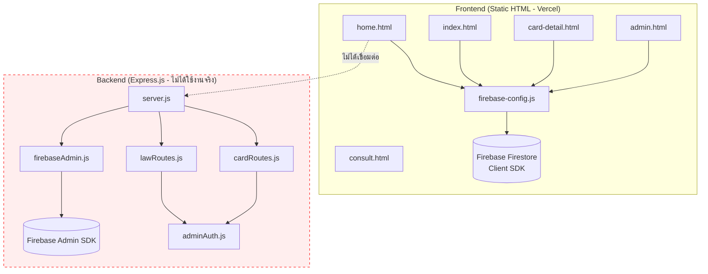

# โปรเจค WEB-LAW — รายงานวิเคราะห์สถาปัตยกรรมฉบับเต็ม

---

## สรุปภาพรวมสำหรับผู้บริหาร

โปรเจคนี้เป็น **เว็บพอร์ทัลข้อมูลกฎหมาย IT ของไทย** (Frontend: HTML/CSS/JS แบบ Static, Backend: Express.js + Firebase Admin) มีไฟล์ซอร์สโค้ดราว 30 ไฟล์ ประมาณ 3,500 บรรทัด ระบบใช้งานได้ แต่มี **ช่องโหว่ความปลอดภัยระดับวิกฤต**, โค้ดซ้ำซ้อนมาก, ไม่มีการทดสอบใดๆ, ไม่มี CI/CD และรูปแบบสถาปัตยกรรมที่ไม่สามารถขยายตัวได้

**สรุประดับความรุนแรง:**
| ระดับ | จำนวน | ตัวอย่าง |
|-------|--------|----------|
| 🔴 วิกฤต | 4 | Private key หลุด, XSS, hardcode อีเมลแอดมิน, ไม่มี sanitization |
| 🟠 สูง | 6 | ไม่มี test, ไม่มี CI/CD, โค้ดซ้ำ, ไม่ใช้ env vars, backend ไม่ได้ใช้งาน |
| 🟡 ปานกลาง | 8 | ไม่มี viewport meta, ไม่มี error boundaries, global state, inline scripts |
| 🔵 ต่ำ | 5 | ตั้งชื่อไม่สม่ำเสมอ, ไม่มี linting, หน่วย CSS ปะปน |

---

## การวิเคราะห์สถาปัตยกรรม

### แผนภาพสถาปัตยกรรมปัจจุบัน



### ข้อสังเกตสำคัญ

1. **Backend ไม่ได้ใช้งานเลย** — Frontend เชื่อมต่อ Firestore ผ่าน Client SDK โดยตรง Express backend มี routes และ middleware แต่ไม่เคยถูกเรียกใช้ เป็น dead code ทั้งหมด
2. **ไม่มีการแยก concerns** — ไฟล์ HTML มี `<script>` แบบ inline ผสมระหว่าง business logic, DOM manipulation และ data fetching
3. **ปนเปื้อน global namespace** — `firebase-config.js` ผูก `db` และ `auth` กับ `window` ทุกไฟล์ JS ใช้ global แบบ implicit
4. **ไม่มีระบบ module** — ใช้ `<script>` tag แบบ global function ไม่มี ES modules ไม่มี bundler
5. **สถาปัตยกรรมแบบ page-per-file** — แต่ละหน้าเป็น HTML อิสระ มี CSS/JS เฉพาะตัว logic ที่ใช้ร่วมกันถูก copy-paste

---

## ปัญหาวิกฤต

### 🔴 วิกฤต-1: Private Key ของ Firebase Service Account หลุด

> [!CAUTION]
> **ไฟล์:** [serviceAccountKey.json](file:///d:/web%20test/backend/serviceAccountKey.json)
> Private key ของ Firebase service account ถูก commit เข้า repository **ทำให้ใครก็ตามที่เข้าถึง repo นี้ได้จะมีสิทธิ์ admin เต็มรูปแบบ** กับ Firebase project (Firestore, Auth, Cloud Storage ฯลฯ)

**ผลกระทบ:** ศักยภาพในการถูก data breach เต็มรูปแบบ ผู้โจมตีสามารถ:
- อ่านข้อมูลผู้ใช้ทั้งหมดและเนื้อหากฎหมาย
- ลบฐานข้อมูล Firestore ทั้งหมด
- สร้าง/ลบผู้ใช้ Firebase Auth
- ปลอมตัวเป็นผู้ใช้คนใดก็ได้

**ต้องดำเนินการทันที:**
1. Rotate key ใน Google Cloud Console ทันที
2. ใช้ `git filter-branch` หรือ `git filter-repo` ลบออกจาก git history
3. ใช้ environment variables แทนการ commit secrets

---

### 🔴 วิกฤต-2: Firebase API Key ถูก Hardcode ในซอร์สโค้ด

**ไฟล์ที่เกี่ยวข้อง:**
- [firebase-config.js](file:///d:/web%20test/frontend/js/firebase-config.js) — มี config ครบ (`apiKey`, `projectId` ฯลฯ)
- [config.js](file:///d:/web%20test/frontend/js/config.js) — API key ซ้ำ

`.gitignore` พยายามแยก `config.js` ออก แต่ `firebase-config.js` **ไม่ได้ถูก ignore** และมี **API key ตัวเดียวกัน** พร้อม Firebase config เต็มรูปแบบ การป้องกันจึงถูก bypass

---

### 🔴 วิกฤต-3: ช่องโหว่ XSS (Cross-Site Scripting)

หลายไฟล์ใส่ข้อมูลจากฐานข้อมูลผ่าน `innerHTML` โดยไม่มี sanitization:

| ไฟล์ | บรรทัด | รูปแบบ |
|------|--------|--------|
| [home.html](file:///d:/web%20test/frontend/home.html) | 196-204 | `container.innerHTML += \`...\${card.title}...\`` |
| [admin.js](file:///d:/web%20test/frontend/js/admin.js) | 108-128 | `div.innerHTML += \`...\${law.section}...\`` |
| [admin.js](file:///d:/web%20test/frontend/js/admin.js) | 255-268 | `container.innerHTML += \`...\${card.title}...\`` |
| [card-detail.js](file:///d:/web%20test/frontend/js/card-detail.js) | 99 | `contentEl.innerHTML = card.pageContent` — **แสดง HTML ดิบจาก DB** |
| [viewer.js](file:///d:/web%20test/frontend/js/viewer.js) | 50-53 | `div.innerHTML = \`...\${law.description}...\`` |

**ผลกระทบ:** หากมีคนใส่ HTML/JS อันตรายใน `pageContent`, `title` หรือ `description` มันจะทำงานในเบราว์เซอร์ของผู้เข้าชมทุกคน ฟิลด์ `pageContent` ออกแบบมารับ HTML โดยตรง ทำให้เป็น **Stored XSS by design**

---

### 🔴 วิกฤต-4: อีเมลแอดมิน Hardcode ในโค้ด

**ไฟล์:** [adminAuth.js](file:///d:/web%20test/backend/middleware/adminAuth.js#L15)
```javascript
if (decoded.email !== "nattapat110803@gmail.com") {
    return res.status(403).json({ message: "Not admin" });
}
```
การตรวจสอบสิทธิ์แอดมินเป็นการเปรียบเทียบ string แบบ hardcode ไม่สามารถขยายรองรับหลายแอดมินได้ และเปิดเผยอีเมลส่วนตัวในซอร์สโค้ด

---

## ความเสี่ยงด้านการขยายตัว

| ความเสี่ยง | สถานะปัจจุบัน | ผลกระทบ | แนวทางแก้ไข |
|------------|--------------|---------|------------|
| **ไม่มี pagination** | โหลดกฎหมาย/การ์ดทั้งหมดทีเดียว | หน้าค้างเมื่อมี >100 รายการ | เพิ่ม cursor-based pagination |
| **ไม่มี caching** | ทุก page load = อ่าน Firestore | ค่าใช้จ่ายเพิ่มตามทราฟฟิก | เพิ่ม service worker / CDN cache |
| **ไม่มี search** | ไม่มีระบบค้นหา full-text | ผู้ใช้หากฎหมายเฉพาะไม่ได้ | ใช้ Algolia หรือ Typesense |
| **CSS แยกส่วน** | แต่ละหน้ามี CSS เฉพาะ ไม่มี design tokens | ทุกหน้าใหม่ = CSS ใหม่ | สร้าง shared design system |
| **เข้าถึง Firestore ตรง** | Client SDK ข้าม backend | ไม่มี rate limiting ไม่มี validation | ใช้ API gateway |

---

## ปัญหาคุณภาพโค้ด

### โค้ดซ้ำซ้อน (ละเมิดหลัก DRY)

**1. โหลด Navbar — ซ้ำใน HTML ทั้ง 5 ไฟล์:**
```javascript
// บล็อกเหมือนกันใน: index.html, home.html, card-detail.html, admin.html, consult.html
fetch("components/navbar.html")
    .then(res => res.text())
    .then(html => { document.getElementById("navbar").innerHTML = html; });
```

**2. ปุ่ม LINE + wiggle animation — ซ้ำใน 3 ไฟล์:**
```javascript
// บล็อกเหมือนกันใน: index.html, home.html, card-detail.html
const lineBtn = document.querySelector(".line-float");
if (lineBtn) { setInterval(() => { ... }, 5000); }
```

**3. Firebase SDK script tags — ซ้ำใน 4 ไฟล์ HTML**

**4. Category labels mapping — ซ้ำใน 2 ไฟล์ JS** (`card-detail.js` และ `admin.js`)

**5. `page-content` padding-top — กำหนดซ้ำใน 5 ไฟล์ CSS**

### ตัวแปร Global แบบ Implicit

ใน `admin.js` อ้างอิง DOM elements ด้วยชื่อตัวแปรเปล่า (`section`, `title`, `description`, `penalty`, `saveBtn`) โดยไม่ใช้ `document.getElementById()` ซึ่งทำงานได้เพราะเบราว์เซอร์สร้าง global จาก element ID แต่เป็นวิธีที่เปราะบางและจะพังเมื่อมี ID ซ้ำ

### HTML เสียหาย

**ไฟล์:** [index.html](file:///d:/web%20test/frontend/index.html#L25) — บรรทัด 25 มี `</section>` ปิดแท็กลอย ไม่มีแท็กเปิดคู่กัน

### ไฟล์ที่ไม่ได้ใช้

- [home.js](file:///d:/web%20test/frontend/js/home.js) — กำหนดฟังก์ชัน `goToLaw()` แต่ไม่มี HTML ไหนโหลดไฟล์นี้
- [navbar.js](file:///d:/web%20test/frontend/js/navbar.js) — กำหนดฟังก์ชัน `toggleMenu()` แต่ navbar.html ไม่มีปุ่ม hamburger ที่เรียกใช้
- **backend/ ทั้งหมด** — ไม่ได้เชื่อมต่อกับ frontend ใน production

### ขาด Viewport Meta Tags

มีเฉพาะ `card-detail.html` ที่มี `<meta name="viewport">` หน้าอื่นๆ ทั้งหมดขาดไป ทำให้หน้าเว็บ **แสดงผลผิดพลาดบนมือถือ**:
- ❌ `index.html` / ❌ `home.html` / ❌ `admin.html` / ❌ `consult.html`

---

## รายการช่องโหว่ความปลอดภัย

| # | ระดับ | ปัญหา | ไฟล์ |
|---|-------|-------|------|
| S1 | 🔴 วิกฤต | Private key ใน git history | `serviceAccountKey.json` |
| S2 | 🔴 วิกฤต | XSS ผ่าน innerHTML กับข้อมูลจาก DB | `home.html`, `admin.js`, `card-detail.js`, `viewer.js` |
| S3 | 🔴 วิกฤต | Stored XSS by design (pageContent รับ HTML ดิบ) | `card-detail.js:99` |
| S4 | 🟠 สูง | ไม่จำกัด CORS | `server.js` — `app.use(cors())` อนุญาตทุก origin |
| S5 | 🟠 สูง | ไม่มี rate limiting | `server.js` |
| S6 | 🟠 สูง | ไม่มี input validation/sanitization (backend) | `lawRoutes.js`, `cardRoutes.js` |
| S7 | 🟠 สูง | ไม่มี CSP headers | ทุกไฟล์ HTML |
| S8 | 🟡 ปานกลาง | อีเมลแอดมินเปิดเผยในซอร์สโค้ด | `adminAuth.js` |
| S9 | 🟡 ปานกลาง | ไม่บังคับ HTTPS | `vercel.json` |
| S10 | 🟡 ปานกลาง | Firebase Security Rules ยังไม่ได้ตรวจสอบ | ไม่ทราบ |
| S11 | 🟡 ปานกลาง | ไม่มี authentication สำหรับ Firestore reads ฝั่ง frontend | `firebase-config.js` |

---

## ปัญหาประสิทธิภาพ

| # | ปัญหา | ผลกระทบ | ไฟล์ |
|---|-------|---------|------|
| P1 | ไม่มี lazy loading สำหรับรูปภาพ | หน้าโหลดช้า | `home.html` |
| P2 | รูปภาพจาก Pinterest CDN ภายนอก | ควบคุม cache/availability ไม่ได้ | ทุกไฟล์ HTML |
| P3 | Firebase SDK โหลดแบบ synchronous | บล็อกการ render | ทุกไฟล์ HTML |
| P4 | `innerHTML +=` ในลูป สร้าง DOM ใหม่ทุกรอบ | O(n²) DOM operations | `admin.js`, `home.html`, `viewer.js` |
| P5 | ไม่มี minification หรือ bundling | payload ใหญ่ HTTP requests เยอะ | ทุกไฟล์ |
| P6 | `setInterval` สำหรับ wiggle ไม่เคยถูก clear | memory leak | 3 ไฟล์ HTML |
| P7 | ไม่มี service worker หรือ caching strategy | ทุกครั้งที่เข้า = โหลดใหม่ทั้งหมด | ทั้งโปรเจค |
| P8 | ใช้ Firebase SDK แบบ compat (v9 compat) แทน modular | bundle ใหญ่กว่า ~3 เท่า | ทุกไฟล์ HTML |

---

## บัญชีหนี้ทางเทคนิค

| ID | รายการ | ใช้เวลา | ความเสี่ยง | ลำดับความสำคัญ |
|----|--------|--------|-----------|---------------|
| TD1 | Secrets หลุดใน git history | 2 ชม. | 🔴 วิกฤต | P0 |
| TD2 | ไม่มี test suite ใดๆ | 8 ชม. | 🟠 สูง | P1 |
| TD3 | Backend เป็น dead code | 2 ชม. | 🟡 ปานกลาง | P2 |
| TD4 | โค้ดโหลด navbar ซ้ำ 5 ที่ | 1 ชม. | 🟡 ปานกลาง | P2 |
| TD5 | โค้ดปุ่ม LINE ซ้ำ 3 ที่ | 1 ชม. | 🟡 ปานกลาง | P2 |
| TD6 | ไม่มี build system / bundler | 4 ชม. | 🟠 สูง | P1 |
| TD7 | ปนเปื้อน global namespace | 3 ชม. | 🟠 สูง | P2 |
| TD8 | ขาด viewport meta tags | 0.5 ชม. | 🟡 ปานกลาง | P2 |
| TD9 | HTML เสีย (stray `</section>`) | 0.5 ชม. | 🟡 ปานกลาง | P3 |
| TD10 | ไฟล์ JS ไม่ได้ใช้ (home.js, navbar.js) | 0.5 ชม. | 🔵 ต่ำ | P3 |
| TD11 | สถาปัตยกรรม CSS ไม่สม่ำเสมอ | 6 ชม. | 🟡 ปานกลาง | P2 |
| TD12 | ไม่มี error handling UI | 4 ชม. | 🟡 ปานกลาง | P2 |
| TD13 | ไม่มีเอกสาร (README) | 2 ชม. | 🟡 ปานกลาง | P2 |

**ประมาณการเวลาแก้หนี้ทั้งหมด: ~35 ชั่วโมง**

---

## ข้อเสนอแนะเป็นรายไฟล์

### Backend

| ไฟล์ | ปัญหา | แนวทางแก้ไข |
|------|-------|------------|
| [server.js](file:///d:/web%20test/backend/server.js) | CORS เปิดกว้าง, ไม่มี rate limiting, hardcode port, `main` ใน package.json ผิด | เพิ่ม CORS whitelist, helmet, rate-limit, ใช้ `PORT` จาก env var |
| [firebaseAdmin.js](file:///d:/web%20test/backend/firebaseAdmin.js) | ใช้ `createRequire` สำหรับ JSON, ไม่มี error handling | ใช้ `import` หรือ `fs.readFileSync`, ครอบด้วย try-catch, ใช้ env vars |
| [adminAuth.js](file:///d:/web%20test/backend/middleware/adminAuth.js) | Hardcode อีเมลแอดมิน | ใช้ Firebase Custom Claims (`admin: true`) หรือ Firestore collection `admins` |
| [cardRoutes.js](file:///d:/web%20test/backend/routes/cardRoutes.js) | ไม่มี input validation, CRUD boilerplate ซ้ำ | เพิ่ม `zod` validation, แยก generic CRUD controller |
| [lawRoutes.js](file:///d:/web%20test/backend/routes/lawRoutes.js) | เหมือน cardRoutes + business logic ปนใน routes | แยก validation เป็น middleware, แยก service layer |
| [serviceAccountKey.json](file:///d:/web%20test/backend/serviceAccountKey.json) | **PRIVATE KEY หลุด** | Rotate ทันที ลบจาก repo ใช้ env vars |

### Frontend HTML

| ไฟล์ | ปัญหา | แนวทางแก้ไข |
|------|-------|------------|
| [home.html](file:///d:/web%20test/frontend/home.html) | ไม่มี viewport, inline JS ~80 บรรทัด, XSS, ลิงก์ไปหน้าที่ไม่มีอยู่ | เพิ่ม viewport, แยก JS เป็นไฟล์, sanitize output, แก้ dead links |
| [index.html](file:///d:/web%20test/frontend/index.html) | ไม่มี viewport, `</section>` ลอย, inline scripts | แก้ HTML, เพิ่ม viewport, แยก scripts |
| [card-detail.html](file:///d:/web%20test/frontend/card-detail.html) | มี viewport ✓ แต่ render HTML ดิบจาก DB (XSS) | ใช้ DOMPurify sanitize `pageContent` |
| [admin.html](file:///d:/web%20test/frontend/admin.html) | ไม่มี viewport, ไม่มี CSRF, ลิงก์ admin เห็นทุกคน | เพิ่ม viewport, ซ่อนลิงก์ admin |
| [consult.html](file:///d:/web%20test/frontend/consult.html) | ไม่มี viewport, เนื้อหา hardcode | เพิ่ม viewport; พิจารณาทำเป็น data-driven |

### Frontend JS

| ไฟล์ | ปัญหา | แนวทางแก้ไข |
|------|-------|------------|
| [firebase-config.js](file:///d:/web%20test/frontend/js/firebase-config.js) | API keys hardcode, ใช้ global บน window | ใช้ env vars ผ่าน build tool, ใช้ ES modules |
| [admin.js](file:///d:/web%20test/frontend/js/admin.js) | 409 บรรทัด monolith, implicit DOM globals, XSS | แยกเป็น modules (auth, laws, cards), ใช้ `textContent` |
| [card-detail.js](file:///d:/web%20test/frontend/js/card-detail.js) | Render HTML ดิบจาก DB | ใช้ DOMPurify |
| [viewer.js](file:///d:/web%20test/frontend/js/viewer.js) | `throw new Error` ระดับ top level หยุดทุกอย่าง, XSS | ใช้ early return แทน throw, sanitize output |
| [home.js](file:///d:/web%20test/frontend/js/home.js) | **ไม่ได้ใช้เลย** — ไม่มี HTML ไหนโหลด | ลบออก |
| [navbar.js](file:///d:/web%20test/frontend/js/navbar.js) | **ไม่ได้ใช้เลย** — ไม่มี HTML ไหนโหลด | ลบออก |

### Frontend CSS

| ไฟล์ | ปัญหา | แนวทางแก้ไข |
|------|-------|------------|
| [navbar.css](file:///d:/web%20test/frontend/css/navbar.css) | ไฟล์เดียวที่ใช้ CSS custom properties | รูปแบบดี — ขยายไปใช้ใน CSS ทุกไฟล์ |
| [main.css](file:///d:/web%20test/frontend/css/main.css) | ซ้ำกับ `page-content` และ `body` จากไฟล์อื่น | แยก shared styles เป็น `base.css` |
| [admin.css](file:///d:/web%20test/frontend/css/admin.css) | 374 บรรทัด ผสม layout + component + utility | แยกเป็น component files |
| [line-button.css](file:///d:/web%20test/frontend/css/line-button.css) | ใช้ `!important` | ลบ `!important`, เพิ่ม specificity ตามธรรมชาติ |
