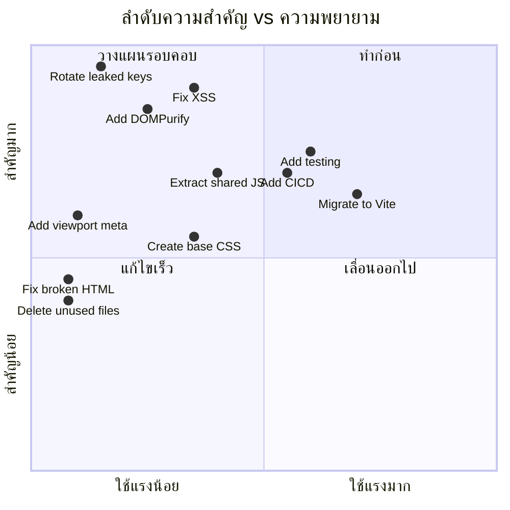
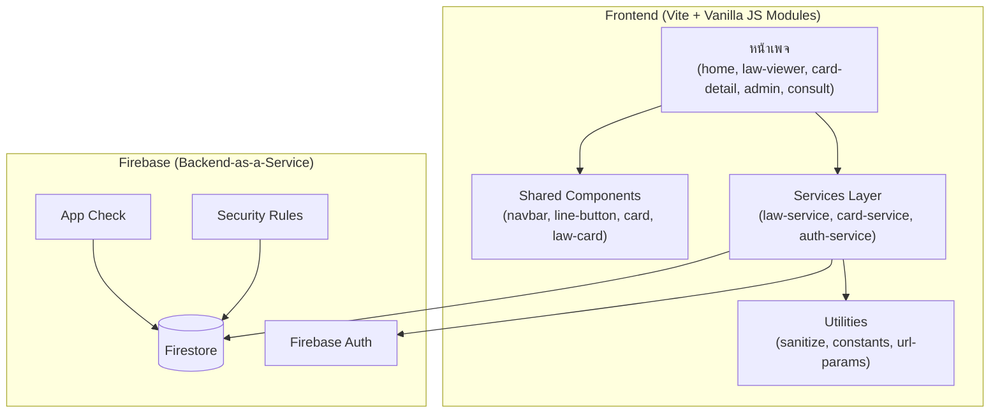

# โปรเจค WEB-LAW — แผนการ Refactoring และมาตรฐาน

---

## แผน Migration

### เฟส 0: แก้ไขความปลอดภัยฉุกเฉิน (วันที่ 1) ⚡

> [!CAUTION]
> **ทำสิ่งนี้ก่อนงานอื่นทั้งหมด**

- [ ] **Rotate Firebase service account key** ใน Google Cloud Console → IAM → Service Accounts
- [ ] **ล้าง git history** ของ `serviceAccountKey.json`:
  ```bash
  git filter-repo --path backend/serviceAccountKey.json --invert-paths
  ```
- [ ] **เพิ่ม `firebase-config.js` ใน `.gitignore`** (ปัจจุบันถูก track อยู่พร้อม keys)
- [ ] **ตรวจสอบ Firebase Security Rules** — ตรวจให้แน่ใจว่า Firestore rules จำกัด reads/writes อย่างเหมาะสม
- [ ] **เปิดใช้ Firebase App Check** เพื่อป้องกันการใช้ API โดยไม่ได้รับอนุญาต

### เฟส 1: พื้นฐานและความสะอาด (สัปดาห์ที่ 1)

- [ ] เพิ่ม `<meta name="viewport">` ใน `index.html`, `home.html`, `admin.html`, `consult.html`
- [ ] แก้ `</section>` ลอยใน `index.html` (บรรทัด 25)
- [ ] ลบไฟล์ที่ไม่ได้ใช้: `home.js`, `navbar.js`
- [ ] เพิ่มปุ่ม hamburger menu ใน `navbar.html`
- [ ] สร้าง `README.md` จากไฟล์ `คำสั่ง`
- [ ] แก้ `package.json`: ตั้ง `"main": "server.js"`, เพิ่ม `"start"` script
- [ ] เพิ่ม `.env.example` และย้าย config ทั้งหมดเป็น environment variables
- [ ] แก้ dead links ใน `home.html` (`article2.html`, `article3.html`)

### เฟส 2: เสริมความปลอดภัย (สัปดาห์ที่ 2)

- [ ] ติดตั้งและ configure DOMPurify สำหรับทุก `innerHTML` rendering
- [ ] เปลี่ยน `innerHTML +=` เป็น `textContent` หรือ DOM API
- [ ] เพิ่ม Content Security Policy headers ผ่าน `vercel.json`
- [ ] เพิ่ม `express-rate-limit` และ `helmet` ใน backend
- [ ] เปลี่ยน hardcode อีเมลแอดมินเป็น Firebase Custom Claims
- [ ] จำกัด CORS เฉพาะ origin ที่อนุญาต
- [ ] เพิ่ม input validation ด้วย `zod` ใน backend routes

### เฟส 3: รวมโค้ด (สัปดาห์ที่ 3)

- [ ] แยกโค้ดที่ใช้ร่วมกันเป็น modules ที่ reuse ได้:
  - `shared/navbar-loader.js` — logic โหลด navbar
  - `shared/line-button.js` — ปุ่มลอย LINE + wiggle
  - `shared/firebase-init.js` — Firebase initialization
  - `shared/constants.js` — category labels, URLs, config
  - `shared/sanitize.js` — DOMPurify wrapper
- [ ] สร้าง `css/base.css` สำหรับ shared reset, typography, variables
- [ ] ขยาย CSS custom properties จาก `navbar.css` ไปใช้ทุก stylesheet
- [ ] ลบ rules ที่ซ้ำ (`body`, `.page-content`) ออกจาก CSS แต่ละหน้า

### เฟส 4: ปรับปรุงสถาปัตยกรรม (สัปดาห์ที่ 4-5)

- [ ] ตัดสินใจ: เก็บ backend หรือใช้ Firebase client-side ล้วน
  - **ตัวเลือก A:** ลบ backend ทั้งหมด (ตรงกับพฤติกรรม production ปัจจุบัน)
  - **ตัวเลือก B:** ส่ง requests ทั้งหมดผ่าน backend (ปลอดภัยกว่า)
- [ ] นำ Vite มาใช้เป็น build tool เพื่อ:
  - รองรับ ES modules
  - ฉีด environment variables
  - Minify CSS/JS
  - Tree-shaking โค้ดที่ไม่ใช้
- [ ] ย้ายจาก Firebase compat SDK ไปเป็น modular SDK (v9+)
- [ ] เพิ่ม service worker สำหรับ offline caching

### เฟส 5: การทดสอบและ CI/CD (สัปดาห์ที่ 6)

- [ ] เพิ่ม unit tests ด้วย Vitest สำหรับ utility functions
- [ ] เพิ่ม E2E tests ด้วย Playwright สำหรับ critical flows
- [ ] ตั้งค่า GitHub Actions pipeline: Lint → Test → Build → Deploy
- [ ] เพิ่ม pre-commit hooks ด้วย Husky + lint-staged
- [ ] เพิ่ม Lighthouse CI สำหรับติดตาม performance

---

## เฟสการ Refactoring (Priority Matrix)



---

## สถาปัตยกรรมที่แนะนำ

### สถาปัตยกรรมเป้าหมาย (Clean Architecture)



### หลักการสำคัญ

1. **Services Layer** — การเรียก Firebase ทั้งหมดผ่าน service modules ไม่เรียก `db.collection()` โดยตรงในโค้ดหน้าเพจ
2. **Components** — ชิ้นส่วน HTML/CSS/JS ที่ reuse ได้ โหลดแบบ dynamic หรือผ่าน build tool
3. **Sanitization** — เนื้อหาจาก DB ทั้งหมดผ่าน DOMPurify ก่อนใส่ใน DOM
4. **Environment Config** — keys/URLs ทั้งหมดโหลดจาก `import.meta.env` (Vite) หรือไฟล์ `.env`

---

## โครงสร้างโฟลเดอร์ที่แนะนำ

```
web-law/
├── README.md
├── .env.example
├── .gitignore
├── .github/
│   └── workflows/
│       └── ci.yml
├── frontend/
│   ├── index.html                    # Entry point (Vite)
│   ├── vite.config.js
│   ├── package.json
│   ├── public/
│   │   ├── favicon.ico
│   │   └── robots.txt
│   ├── src/
│   │   ├── main.js                   # App bootstrap
│   │   ├── pages/
│   │   │   ├── home.js
│   │   │   ├── law-viewer.js
│   │   │   ├── card-detail.js
│   │   │   ├── admin.js
│   │   │   └── consult.js
│   │   ├── components/
│   │   │   ├── navbar.js
│   │   │   ├── line-button.js
│   │   │   ├── law-card.js
│   │   │   ├── image-card.js
│   │   │   └── banner-slider.js
│   │   ├── services/
│   │   │   ├── firebase.js           # Firebase init (แหล่งเดียว)
│   │   │   ├── law.service.js
│   │   │   ├── card.service.js
│   │   │   └── auth.service.js
│   │   ├── utils/
│   │   │   ├── sanitize.js           # DOMPurify wrapper
│   │   │   ├── constants.js          # Category labels, URLs
│   │   │   ├── url-params.js         # Query string helpers
│   │   │   └── dom.js                # Safe DOM helpers
│   │   └── styles/
│   │       ├── base.css              # Reset, typography, variables
│   │       ├── layout.css            # Grid, containers
│   │       ├── components/
│   │       │   ├── navbar.css
│   │       │   ├── card.css
│   │       │   ├── button.css
│   │       │   ├── form.css
│   │       │   └── line-button.css
│   │       └── pages/
│   │           ├── home.css
│   │           ├── admin.css
│   │           └── consult.css
│   └── tests/
│       ├── unit/
│       │   ├── sanitize.test.js
│       │   └── law.service.test.js
│       └── e2e/
│           ├── home.spec.js
│           └── admin.spec.js
├── firebase/
│   ├── firestore.rules
│   └── firebase.json
└── docs/
    ├── architecture.md
    └── deployment.md
```

---

## มาตรฐานการเขียนโค้ดที่แนะนำ

### JavaScript

```javascript
// ✅ ใช้ ES modules
import { getLaws } from '../services/law.service.js';

// ✅ ใช้ const/let ห้ามใช้ var
const MAX_CARDS = 20;
let currentPage = 1;

// ✅ ใช้ async/await พร้อม try-catch
async function loadLaws(category) {
    try {
        const laws = await getLaws(category);
        renderLaws(laws);
    } catch (error) {
        showError('ไม่สามารถโหลดข้อมูลกฎหมายได้');
        console.error('[LawViewer]', error);
    }
}

// ✅ ใช้ textContent สำหรับข้อความ, DOMPurify สำหรับ HTML
element.textContent = law.title;              // ปลอดภัย
element.innerHTML = DOMPurify.sanitize(html);  // ผ่าน sanitize

// ✅ ตั้งชื่อฟังก์ชันที่อธิบายตัวเองได้
function renderLawCard(law) { /* ... */ }   // ✅ ดี
function loadData() { /* ... */ }           // ❌ กว้างเกินไป
```

### CSS

```css
/* ✅ ใช้ CSS custom properties สำหรับ design tokens */
:root {
    --color-primary: #667eea;
    --color-primary-dark: #764ba2;
    --color-danger: #e53935;
    --color-text: #1f2937;
    --radius-sm: 8px;
    --radius-md: 12px;
    --radius-lg: 16px;
    --shadow-card: 0 6px 18px rgba(0, 0, 0, 0.12);
    --nav-height: 64px;
    --font-thai: "TH Sarabun New", "Segoe UI", sans-serif;
}

/* ✅ ใช้ BEM naming */
.law-card { }
.law-card__title { }
.law-card__penalty { }
.law-card--featured { }

/* ❌ หลีกเลี่ยง !important */
/* ❌ หลีกเลี่ยงการ style ด้วย element ID */
```

### กฎการตั้งชื่อ

| หมวด | รูปแบบ | ตัวอย่าง |
|------|--------|----------|
| ไฟล์ (JS) | kebab-case | `law.service.js`, `card-detail.js` |
| ไฟล์ (CSS) | kebab-case | `law-card.css`, `base.css` |
| ฟังก์ชัน | camelCase | `loadLaws()`, `renderCard()` |
| ค่าคงที่ | SCREAMING_SNAKE | `MAX_ITEMS`, `API_BASE_URL` |
| CSS Classes | BEM (kebab) | `.card__title`, `.btn--primary` |
| HTML IDs | kebab-case | `law-list`, `admin-panel` |

---

## CLAUDE.md ที่แนะนำ

```markdown
# CLAUDE.md — โปรเจค WEB-LAW

## ภาพรวมโปรเจค
เว็บพอร์ทัลข้อมูลกฎหมาย IT ภาษาไทย
Frontend: static HTML/JS/CSS deploy บน Vercel
Backend: Node.js + Express 5 (ไม่ได้ใช้ใน production)
Database: Firebase Firestore | Auth: Firebase Authentication

## Tech Stack
- Frontend: Vanilla HTML/CSS/JavaScript (ไม่ใช้ framework)
- Backend: Node.js + Express 5 (ES Modules)
- Database: Firebase Firestore
- Deployment: Vercel (frontend เท่านั้น)

## โครงสร้าง
- `frontend/` — ไฟล์เว็บไซต์ static (HTML, CSS, JS)
- `backend/` — Express.js API (ยังไม่ได้ deploy)
- `frontend/components/` — HTML fragments ที่ใช้ร่วม (navbar)
- `frontend/js/` — JavaScript เฉพาะหน้า
- `frontend/css/` — Stylesheets เฉพาะหน้า

## รูปแบบสำคัญ
- Navbar โหลดผ่าน fetch() ในทุกหน้า
- ใช้ Firebase client SDK โดยตรง (ไม่ผ่าน backend)
- Admin panel ใช้ Firebase Auth สำหรับ login จากนั้นเขียน Firestore ตรง
- ทุกหน้าเป็นไฟล์ HTML อิสระ (ไม่มี SPA routing)

## คำเตือนสำคัญ
- ห้าม commit API keys หรือ service account keys
- firebase-config.js มี Firebase config แบบ hardcode — ควรใช้ env vars
- admin.js ใช้ implicit DOM globals (อ้างอิง elements ด้วย ID เป็นตัวแปร)
- ฟิลด์ pageContent ใน cards collection มี HTML ดิบ — ต้อง sanitize

## คำสั่ง
- Backend: `cd backend && node server.js` (port 3000)
- Frontend: ใช้ VS Code Live Server (port 5501)

## โครงสร้าง Firestore
- `law/{category}/items/{id}` — รายการกฎหมาย
- `cards/{id}` — การ์ดเนื้อหา
```

---

## AGENTS.md ที่แนะนำ

```markdown
# AGENTS.md — โปรเจค WEB-LAW

## บทบาท Agent

### Security Agent
- สแกนหา secrets ที่ hardcode ในทุกไฟล์
- ตรวจสอบ .gitignore ครอบคลุมไฟล์ sensitive ทั้งหมด
- ตรวจการใช้ innerHTML สำหรับช่องโหว่ XSS
- ตรวจสอบ Firebase Security Rules
- ตรวจ CORS, CSP และ rate limiting

### Frontend Agent
- ตรวจสอบว่า HTML ทุกไฟล์มี viewport meta tag
- ตรวจสอบไม่มีลิงก์เสีย (href ไปหน้าที่ไม่มี)
- ตรวจโครงสร้าง HTML ถูกต้อง (ไม่มีแท็กลอย)
- ตรวจ responsive design ที่ 320px, 768px, 1200px
- ตรวจรูปภาพทุกรูปมี alt attributes

### Code Quality Agent
- ระบุและรายงานโค้ดซ้ำซ้อน
- ตรวจหาไฟล์ที่ไม่ได้ใช้และ dead code
- ตรวจสอบ naming conventions สม่ำเสมอ
- ตรวจสอบไม่มี implicit globals
- รายงานฟังก์ชันที่ยาวเกิน 50 บรรทัด

### Performance Agent
- ตรวจ lazy loading บนรูปภาพ
- ตรวจสอบไม่มี script ที่บล็อกแบบ synchronous
- ตรวจ innerHTML += ในลูป (O(n²))
- ตรวจ bundle sizes

## ขอบเขต Agent
- Security Agent มีสิทธิ์ READ-ONLY ทุกไฟล์
- Frontend Agent แก้ไขได้เฉพาะใน frontend/
- Code Quality Agent แก้ไขได้ทุกไฟล์ซอร์สโค้ด
- ทุก Agent ต้องรักษาคอมเมนต์และข้อความภาษาไทย
```

---

## การประเมินความเสี่ยง

| ความเสี่ยง | ความน่าจะเป็น | ผลกระทบ | แนวทางลด |
|------------|--------------|---------|----------|
| ข้อมูลรั่วจาก key ที่หลุด | สูง | วิกฤต | Rotate key ทันที (เฟส 0) |
| โจมตี XSS ผ่าน pageContent | ปานกลาง | สูง | เพิ่ม DOMPurify (เฟส 2) |
| Firebase quota เกิน | ต่ำ | ปานกลาง | เพิ่ม caching + pagination (เฟส 4) |
| Regression ระหว่าง refactor | ปานกลาง | ปานกลาง | เพิ่ม tests ก่อน refactor (เฟส 5) |
| Vercel deployment พัง | ต่ำ | สูง | เพิ่ม CI/CD พร้อม preview deploys (เฟส 5) |
| ผู้ใช้มือถือใช้งานไม่ได้ | สูง | สูง | เพิ่ม viewport meta (เฟส 1) |

---

## ประมาณการความซับซ้อน

| เฟส | ความซับซ้อน | ชั่วโมงโดยประมาณ | ระดับความเสี่ยง |
|-----|-----------|-----------------|---------------|
| เฟส 0: ความปลอดภัยฉุกเฉิน | ต่ำ | 2-3 ชม. | 🟢 ต่ำ |
| เฟส 1: พื้นฐาน | ต่ำ | 4-6 ชม. | 🟢 ต่ำ |
| เฟส 2: เสริมความปลอดภัย | ปานกลาง | 8-12 ชม. | 🟡 ปานกลาง |
| เฟส 3: รวมโค้ด | ปานกลาง | 12-16 ชม. | 🟡 ปานกลาง |
| เฟส 4: ปรับปรุงสถาปัตยกรรม | สูง | 20-30 ชม. | 🟠 สูง |
| เฟส 5: ทดสอบและ CI/CD | ปานกลาง | 15-20 ชม. | 🟡 ปานกลาง |
| **รวม** | | **61-87 ชม.** | |

---

## คำแนะนำสุดท้าย

1. **ดำเนินการเฟส 0 วันนี้** — Private key ที่หลุดเป็นเหตุการณ์ด้านความปลอดภัยที่ยังดำเนินอยู่
2. **เฟส 1 เป็นผลไม้ที่เก็บง่าย** — viewport meta, ลบ dead code และแก้ HTML ที่เสียทำได้ในรอบเดียว
3. **พิจารณาลบ backend ทิ้งทั้งหมด** — เพิ่มภาระการบำรุงรักษาแต่ไม่ให้คุณค่าเพราะ frontend คุยกับ Firebase โดยตรง หากต้องการ server-side logic ในอนาคต ใช้ Firebase Cloud Functions แทน
4. **DOMPurify เป็นสิ่งที่ขาดไม่ได้** — ฟิลด์ `pageContent` ที่ render HTML ดิบเป็นช่องทาง stored XSS ต้องติดตั้งก่อน launch สาธารณะ
5. **Vite migration (เฟส 4) ให้ผลตอบแทนสูงสุด** — เปิดให้ใช้ ES modules, env vars, minification และ tree-shaking ในขั้นตอนเดียว แต่อย่าทำก่อนเฟส 1-3 เสร็จ
6. **เขียน tests สำหรับโค้ดที่ refactor แล้ว ไม่ใช่โค้ดปัจจุบัน** — การ test global-function spaghetti ปัจจุบันมี ROI ต่ำ รอจนเฟส 3 สร้าง modules ที่ testable ได้ก่อน
